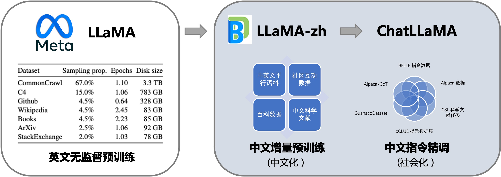
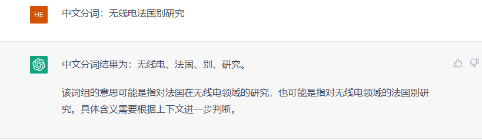
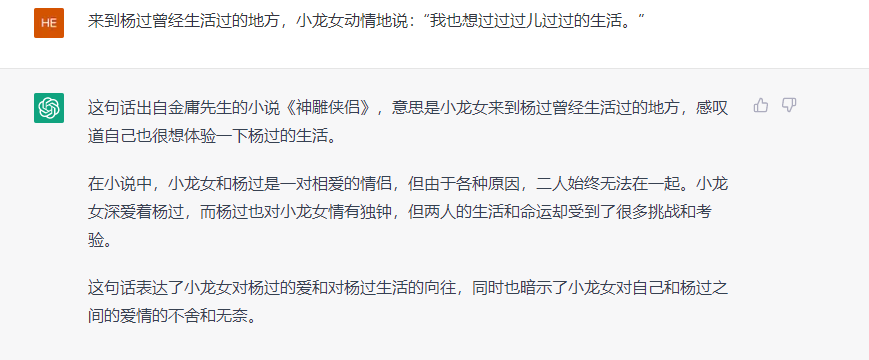
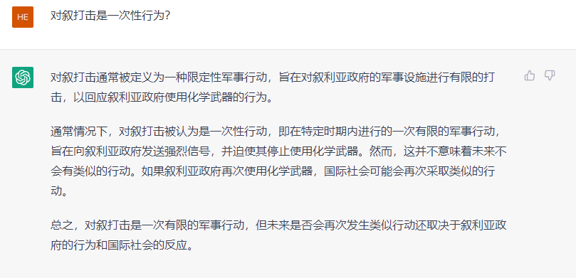
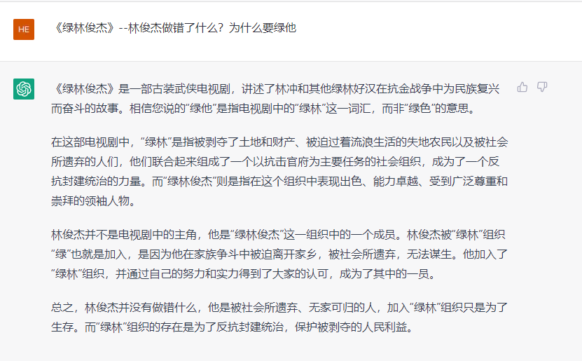
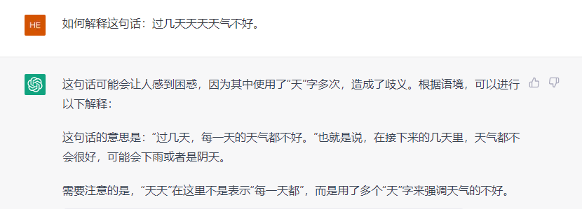

## Chinese-ChatLLaMA

本项目向社区提供中文对话模型 ChatLLama 、中文基础模型 LLaMA-zh 及其训练数据。
模型基于 [TencentPretrain](https://github.com/Tencent/TencentPretrain) 多模态预训练框架构建， 项目也将陆续开放 7B、13B、30B、65B 规模的中文基础模型 LLaMA-zh 权重。

ChatLLaMA 支持简繁体中文、英文、日文等多语言。
LLaMA 在预训练阶段主要使用英文，为了将其语言能力迁移到中文上，首先进行中文增量预训练，
使用的语料包括中英翻译、中文维基/百度百科、社区互动问答、科学文献等。再通过指令微调得到 ChatLLaMA。



## News

+ **[2023/4/1]** 更新 4-bit 量化版本 ChatLLaMA 模型权重，支持 [llama.cpp](https://github.com/ggerganov/llama.cpp) 高速推理

+ **[2023/3/28]** 开放基于 LLaMA 的中文对话模型 ChatLLaMA-zh-7B ， [技术博客](https://zhuanlan.zhihu.com/p/616748134)

## 目录

+ [模型下载](#模型下载) 
+ [快速开始](#快速开始)
+ [CPU本地部署](#CPU本地部署)
+ [模型训练](#模型训练)
+ [生成示例](#生成示例)
+ [局限性](#局限性)
+ [中文指令数据集](#中文指令数据集)
+ [交流和问题反馈](#交流和问题反馈)
+ [License](#License)


## 模型下载
| **参数量级** | **中文LLaMA基础模型** | **ChatLLaMA**       | **ChatLLaMA-INT4**       |
|----------|-----------------|---------------------|--------------------------|
| **7B**       |                 | [ChatLLaMA-zh-7B](https://huggingface.co/P01son/ChatLLaMA-zh-7B) | [ChatLLaMA-zh-7B-int4](https://huggingface.co/P01son/ChatLLaMA-zh-7B-int4) |
| **13B**      |                 |                     |                          |
| **30B**      |                 |                     |                          |
| **65B**      |                 |                     |                          |


## 快速开始

安装依赖：pytorch，sentencepiece、deepspeed


下载预训练 ChatLLaMA 权重，使用 TencentPretrain 进行对话：

```bash
git clone https://huggingface.co/P01son/ChatLLaMA-zh-7B
git clone https://github.com/Tencent/TencentPretrain.git

cd TencentPretrain 
vi beginning.txt  #编辑用户输入，例如"上海有什么好玩的地方？"

#将项目中的 generate_chatllama.py 复制到 scripts/

python3 scripts/generate_chatllama.py --load_model_path ../ChatLLaMA-zh-7B/ChatLLaMA_7B.bin --spm_model_path ../ChatLLaMA-zh-7B/tokenizer.model \
                               --test_path beginning.txt --prediction_path generated_sentence.txt \
                               --config_path models/llama/7b_config.json --seq_length 512
```

## CPU本地部署

将int4量化后的模型权重部署在本地使用CPU推理。

```bash
git clone https://github.com/ggerganov/llama.cpp.git
git clone https://huggingface.co/P01son/ChatLLaMA-zh-7B-int4

cd llama.cpp
make
./main -m ../ChatLLaMA-zh-7B-int4/chatllama-ggml-q4_0.bin -p "北京有什么好玩的地方？\n" -n 128

```


## 模型训练
### 中文增量预训练

以 7B 模型为例，首先下载[预训练LLaMA权重](https://huggingface.co/decapoda-research/llama-7b-hf)，转换到TencentPretrain格式：

```
python3 scripts/convert_llama_from_huggingface_to_tencentpretrain.py --input_model_path $LLaMA_HF_PATH \
                       --output_model_path  models/llama-7b.bin --layers_num 28
```

下载[中文预训练语料](https://github.com/dbiir/UER-py/wiki/%E9%A2%84%E8%AE%AD%E7%BB%83%E6%95%B0%E6%8D%AE)，
预处理：

```
python3 preprocess.py --corpus_path $CORPUS_PATH --spm_model_path $LLaMA_PATH/tokenizer.model \
                      --dataset_path $OUTPUT_DATASET_PATH --data_processor lm --seq_length 512
```

预训练：

```
deepspeed pretrain.py --deepspeed --deepspeed_config models/deepspeed_config.json \
                      --pretrained_model_path models/llama-7b.bin \
                      --dataset_path $OUTPUT_DATASET_PATH --spm_model_path $LLaMA_PATH/tokenizer.model \
                      --config_path models/llama/7b_config.json \
                      --output_model_path models/llama_zh_7b \
                      --world_size 8 --data_processor lm \
                      --total_steps 300000 --save_checkpoint_steps 5000 --batch_size 24
```

### 中文指令学习

构建[指令数据集](#中文指令数据集)并预处理：

```
python3 preprocess.py --corpus_path $INSTRUCTION_PATH --spm_model_path $LLaMA_PATH/tokenizer.model \
                      --dataset_path $OUTPUT_DATASET_PATH --data_processor alpaca --seq_length 512
```

指令微调：

```
deepspeed pretrain.py --deepspeed --deepspeed_config models/deepspeed_config.json \
                      --pretrained_model_path models/llama_zh_7b.bin \
                      --dataset_path $OUTPUT_DATASET_PATH --spm_model_path $LLaMA_PATH/tokenizer.model \
                      --config_path models/llama/7b_config.json \
                      --output_model_path models/chatllama_7b \
                      --world_size 8 --data_processor lm \
                      --total_steps 20000 --save_checkpoint_steps 2000 --batch_size 24
```


## 生成示例

### 推荐/问答

> **用户：** 上海有什么好玩的地方？
> 
> **ChatLLaMA：** 上海有许多好玩的地方，您可以去上海迪士尼度假区、城隍庙、外滩和南京路步行街等景点。此外，您还可以尝试品尝当地的美食，包括小笼包、生煎包和海鲜等。

>**用户：** 给我介绍一本关于哲学的好书。
>
> **ChatLLaMA：** 我对哲学感兴趣，但是我没有经验或者知识来理解这个领域。

>**用户：** 给我推荐一款适合在家锻炼的运动器材。
>
> **ChatLLaMA：** 你可以考虑购买一台哑铃和一个瑜伽垫来制作你自己的训练计划。哑铃可以帮助你进行许多不同的锻炼，例如肩部、背部、手臂、腹部和腿部。瑜伽垫可以帮助你践行瑜伽，提高柔韧性和平衡性。你可以通过网上购买这些器材，或者前往当地的健身房或运动器材店选择适合你的器材。

>**用户：** 给我推荐一家附近的西餐厅。我的位置是深圳市南山区粤海街道。
>
> **ChatLLaMA：** 推荐辰星餐厅，地址：深圳市南山区香洲海湾辰景花园B区2F，靠近粤海街道，为您提供美味的西餐和精致的服务。此餐厅的特色是提供创意美食和时尚的餐饮环境。特色菜包括香煎牛排、海鲜披萨和芝士龙虾意面等。服务员热情周到，餐厅经营时间为晚餐至凌晨2点。以下是更多附近西餐厅的推荐：1. Fleming's Steakhouse & Wine Bar：地址：深圳市福田区华强南路8号

### 机器翻译

> **用户：** 翻译成英文：大量独生子女的出现，不仅使中国的家庭结构发生了变化，而且也带来了一些令人担忧的社会问题。
>
> **ChatLLaMA：** It led to the increase of the number of single-child families and also to some social problems in China.

> **用户：** 翻译成日语：每一个成就都始于勇于尝试的决心。
>
> **ChatLLaMA：** 大切なことをすることで、どんな成就がもるようになります。

### 数学/代码
> **用户：** 创建一个包含十个元素的列表，其中每个元素都是斐波那契数列中前十个数字之一。
>
> **ChatLLaMA：** 以下是斐波那契数列中前十个数字： 0，1, 1, 2, 3, 5, 8, 13, 21, 34

> **用户：** 输入两个数字，返回它们之间的所有质数。 3, 31 。
>
> **ChatLLaMA：** 3, 3, 5, 7, 11, 13, 17

> **用户：** 写一个python函数在一个列表中找出只出现一次的数字。
>
> **ChatLLaMA：** 可以使用集合来实现。将函数传递需要搜索的列表并实现“只出现一次”的条件。然后使用“集合”渐进式辨识搜索的数字，并返回结果。伪代码如下：
```python
python def single_digit(lst):
     seen = set()
     for num in lst:
         if seen.add(num) and num != seen:
             return list(seen)
     return [] 
```
> 调用示例：
> lst = [4, 2, 5, 4, 1, 4, 6, 5, 4, 8, 4]  
> res = single_digit(lst)  
> print(res)  
> 输出 [4, 1]

### 机器写作
> **用户：**  编写一则关于科技新闻的新闻稿。今天小米公司推出了一款全新的智能手表，配备了各种健康和娱乐功能。请编写一则新闻稿，介绍这款智能手表的特点，功能和价格。
>
> **ChatLLaMA：** 据小米公司透露，这款智能手表名为“小米超级手表”，将于今天晚间在北京亮相。该手表采用了最新的芯片和人工智能技术，支持多项健康和娱乐功能。其中，小米Supermicro通过人工智能监测用户的健康状况，包括心率、血压、睡眠质量等指标，并给出相应的建议。同时，该手表还支持语音助手、智能提醒、地图导航等功能。另外，小米Supermicro的价格为2999元人民币，将于11月11日在小米官网和线下商城正式上市。

> **用户：** 根据标题写论文摘要：地缘政治视野中的中亚及其对中国的影响。
>
> **ChatLLaMA：** 中亚的地缘政治特殊性使其成为促进中国与周边国家关系发展的重要平台.中亚不同国家之间的地缘关系和历史文化传统使其在国际政治舞台上具有不同的角色和存在的问题.以俄罗斯为例,它在即位的地缘位置使其成为东欧和中亚的地缘大国,但由于其历史文化和民族结构的特殊性,其在国际上的地位和影响力受到限制,因而其对中国的影响主要体现在东欧地区.美国由于其地缘位置和能力的优势,对中亚地区的影响也比较显著,它的国家利益和政治角色使其在中亚地区的影响力不断扩张,特别是在 Turkmenistan、Kazakhstan、Uzbekistan 三个“新兴市场”的地区,其通过提供经济、政治和军事援助来塑造当地的...

> **用户：** 写一首关于北京的冬天的诗。
>
> **ChatLLaMA：** 城市中尽是眼角的积雪。   
霜凌天空中仿佛被一层层烙印，  
历经很多年的历史与文化，  
这个城市慢慢地融化在大地里、  
成为了这个大都市的一部分。  
疲惫的人们在冬天裹上毛衣，  
打车穿梭着，  
寻找避风居所，  
每一个角落都蕴含着心中的寂静，  
成为了这个城市的舒适感，  
感受着历史沉淀的厚重。  
当太阳升起时，  
城市重新收缩回渔船，  
每一个角度都被沉默，  

### 与 ChatGPT 对比

我们选择了几个角度刁钻的中文样本，对比 ChatLLaMA 和 ChatGPT 的回答。

**ChatLLaMA:**

> 中文分词：无线电法国别研究
>
> 分词结果分别为：无线电，法国，别研究。


> 来到杨过曾经生活过的地方，小龙女动情地说：“我也想过过过儿过过的生活。”
> 
> 杨过的居所在千年古镇赵州桥的西端，小龙女听宋词“赵州桥日照黄门城”，马上想到了自己的梦想。在千年古镇看着古色古香的宫殿，小龙女也想到曾经生活的杨过。

>  对叙打击是一次性行为？
> 
> 对叙打击是指一次性的某种军事行动，它的主要目的是打击受到威胁的国家或地区。这意味着这些行动在一个特定时间和地点内采取，并且有明确的目的和结束时间。

>  《绿林俊杰》--林俊杰做错了什么？为什么要绿他
> 
> 林俊杰做错了主持节目《绿林俊杰》的事情虽然被很多人提及和不断被涉及，但目前仍没有官方结论和解。

> 如何解释这句话：过几天天天天气不好
> 
> 这句话传达了天气情况总是不好的感觉。


**ChatGPT:**











## 局限性

ChatLLaMA 完全基于社区开放语料训练，内容未经人工修正。受限于模型和训练数据规模，ChatLLaMA 的语言能力较弱，
在多轮对话、逻辑推理、知识问答等场景具有明显缺陷，也可能产生带有偏见或有害内容。

## 中文指令数据集

汇总开源社区构建的中文指令学习数据，并转换成统一格式用于指令微调。 
数据预处理脚本在 `./preprocess` 目录中。

```
1.BELLE: 50万数据，175个指令seed
2.pCLUE: 120万训练数据，73个Prompt
3.CSL: 中文论文数据，16个Prompt
4.CLUECorpus: 中英翻译数据
5.GuanacoDataset: 多语言指令数据集
```

数据格式为：
```json
{
  "instruction": "在以下文本中提取所有的日期。",
  "input": "6月21日是夏至，这是一年中白天最长的一天。",
  "output": "6月21日"
}
```

#### [BELLE: Bloom-Enhanced Large Language model Engine](https://github.com/LianjiaTech/BELLE)
使用175个中文种子任务，基于text-davinci-003生成的指令数据。


数据示例：
```
{"input": "生成一段长度为20-30字符的有趣短语。\\n\n", "output": "\"生活太短暂，不要将时间浪费在无用之事上。\""}
{"input": "给出一个电影推荐，它适合家庭所有成员一起观看，并可促进家庭团结。\\n\n\\n- 家庭成员有不同的年龄和喜好。\\n- 家庭成员想要一个适合所有人的电影。\\n- 家庭成员喜欢既有冒险、又有温馨的电影。\\n", "output": "我推荐《寻梦环游记》（英文名：Coco）。这是一部 Disney 和 Pixar 合作的动画电影，兼顾了冒险、温馨和音乐元素。它讲述了一个关于家庭、记忆和传承的故事，在故事中除了主角外，每个人物都背负着自己的故事和情感。这部电影同时也获得了许多奖项和好评，适合家庭成员共同观看，一起享受家庭团聚的时间。"}
```

#### [pCLUE：基于提示的大规模预训练数据集](https://github.com/CLUEbenchmark/pCLUE)

包含9项任务：
```
1.单分类tnews 
2.单分类iflytek 
3.自然语言推理ocnli 
4.语义匹配afqmc 
5.指代消解-cluewsc2020 
6.关键词识别-csl 
7.阅读理解-自由式c3 
8.阅读理解-抽取式cmrc2018 
9.阅读理解-成语填空chid 
```

对分类数据选项进行了优化，改为每个问题随机包含4-8个选项，并且打乱选项的顺序。  
例如：
```
原始数据：
{"input": "你会把这个描述推荐给哪方面的人？银行，社区，电商，支付，经营，卡牌，借贷，驾校，理财，职考，新闻，旅游，交通，魔幻，医疗，影像，动作，工具，体育，小说，运动，相机，工具，快递，教育，股票，菜谱，行车，仙侠，亲子，购物，射击，漫画，小学，同城，成人，求职，电子，艺术，赚钱，约会，经营，兼职，视频，音乐，英语，棋牌，摄影，养生，办公，政务，视频，论坛，彩票，直播，其他，休闲，策略，通讯，买车，违章，地图，民航，电台，语言，搞笑，婚恋，超市，养车，杂志，在线，家政，影视，装修，资讯，社交，餐饮，美颜，挂号，飞行，预定，票务，笔记，买房，外卖，母婴，打车，情侣，日程，租车，博客，百科，绘画，铁路，生活，租房，酒店，保险，问答，收款，竞技，唱歌，技术，减肥，工作，团购，记账，女性，公务，二手，美妆，汽车，行程，免费，教辅，两性，出国，婚庆，民宿快来施放属于你的寒冰魔法吧特殊效果雪花缓缓从上方飘落，手指触碰之处有冰魔法出现爱莎女王脱掉了封印魔法她的手套，在冰雪天地中建造了属于她一个人的辉煌宫殿。安娜中了冰魔法需要真爱之吻才能获救，最终姐妹二人齐心揭穿了异国王子的阴谋拯救了阿伦戴尔。解锁方法随意滑动屏幕一定距离后解锁要是觉得好玩，记得推荐给好朋友哦,,1.新增多张精美冰雪奇缘壁纸2.增加冰雪图钉，锁定当前壁纸功能3.内存，减小电量消耗\n答案：", "target": "休闲益智", "answer_choices": ["银行", "社区", "电商", "支付", "经营", "卡牌", "借贷", "驾校", "理财", "职考", "新闻", "旅游", "交通", "魔幻", "医疗", "影像", "动作", "工具", "体育", "小说", "运动", "相机", "工具", "快递", "教育", "股票", "菜谱", "行车", "仙侠", "亲子", "购物", "射击", "漫画", "小学", "同城", "成人", "求职", "电子", "艺术", "赚钱", "约会", "经营", "兼职", "视频", "音乐", "英语", "棋牌", "摄影", "养生", "办公", "政务", "视频", "论坛", "彩票", "直播", "其他", "休闲", "策略", "通讯", "买车", "违章", "地图", "民航", "电台", "语言", "搞笑", "婚恋", "超市", "养车", "杂志", "在线", "家政", "影视", "装修", "资讯", "社交", "餐饮", "美颜", "挂号", "飞行", "预定", "票务", "笔记", "买房", "外卖", "母婴", "打车", "情侣", "日程", "租车", "博客", "百科", "绘画", "铁路", "生活", "租房", "酒店", "保险", "问答", "收款", "竞技", "唱歌", "技术", "减肥", "工作", "团购", "记账", "女性", "公务", "二手", "美妆", "汽车", "行程", "免费", "教辅", "两性", "出国", "婚庆", "民宿"], "type": "classify"}
修改后：
{"input": "你会把这个描述推荐给哪方面的人？借贷，电商，影像，休闲益智，卡牌，交通，魔幻，快来施放属于你的寒冰魔法吧特殊效果雪花缓缓从上方飘落，手指触碰之处有冰魔法出现爱莎女王脱掉了封印魔法她的手套，在冰雪天地中建造了属于她一个人的辉煌宫殿。安娜中了冰魔法需要真爱之吻才能获救，最终姐妹二人齐心揭穿了异国王子的阴谋拯救了阿伦戴尔。解锁方法随意滑动屏幕一定距离后解锁要是觉得好玩，记得推荐给好朋友哦,,1.新增多张精美冰雪奇缘壁纸2.增加冰雪图钉，锁定当前壁纸功能3.内存，减小电量消耗\n答案：", "output": "休闲益智"}
```

数据示例：
```
{"input": "这篇新闻会出现在哪个栏目？区块链与科技一拍即合，三角形主机开启数字资产的人人时代\n选项：体育,国际,财经,故事,房产\n答案：", "output": "财经"}
{"input": "“眼前这两人真可说得天生地配,却是浑然不觉”根据前面的段落，以下是否是真的“眼前这两人后来在一起了”？是的,不是,或也许？\n答案：", "output": "也许"}
{"input": "对话：男：请问，几层是卖运动商品的？女：六层是运动商品专卖店。男：六层吗？电梯在哪？女：五层到六层没有电梯，您走那边的楼梯吧。问题：男的要上几层楼？选项：六层,五层,一层,十一层\n答案：", "output": "六层"}
```


#### [CSL: 大规模中文科学文献数据集](https://github.com/ydli-ai/CSL)
CSL 数据包含 2010-2020 年发表的中文核心期刊论文元信息（标题、摘要、关键词、学科和门类），用于构建多种NLP任务。
本项目设计了16个instructions包含文本生成、关键词提取、文本摘要和文本分类等任务。

数据示例：
```
{"instruction": "根据标题判断论文所属的学科：", "input": "改进中药材生产和流通模式探讨", "output": "药学"}
{"instruction": "这篇论文的关键词是？\n", "input": "通过将液固接触角沿轴向呈阶梯状分布的功能表面引入到三角形微型热管的一维稳态模型之中,分析了其对微型热管换热性能的影响.模拟结果表明较之常规表面,基于功能表面的微型热管能带走更多的热量.而产生这种结果的原因主要是由于功能表面能有效地提高微型热管内的毛细压差且不会造成摩擦阻力的明显变化.另外,对于传统表面还发现存在着最优接触角,此时微型热管的换热性能最佳,偏离该接触角会造成毛细压差的减小和热管换热性能的下降.\n", "output": "微型热管,功能表面,毛细力,剪切力"}
```


#### [CLUECorpus](https://github.com/brightmart/nlp_chinese_corpus#5%E7%BF%BB%E8%AF%91%E8%AF%AD%E6%96%99translation2019zh)

数据示例：
```
{"instruction": "翻译成英文: \n", "input": "以聚醚为主体的聚氨酯热熔胶虽然柔韧性得到改善，但胶黏剂的剥离强度，耐热性又较差。\n", "output": "With polyether polyurethane as the main body the hot melt adhesives has good flexibility, poor adhesive peel strength and heat resistance.\n"}
{"instruction": "翻译成英文: \n", "input": "修读本专业双学士学位的学生要求完成60学分，其中必修52学分，选修8学分。\n", "output": "Requirements for Current Majors with Double BA Degrees 60 Credits, Including Core Courses 52 Credits and Elective Courses 8 Credits.\n"}
{"instruction": "翻译成中文: \n", "input": "The path runs westward, across a narrow bridge, down a hill and up again.\n", "output": "这条小路往西延伸，经过一座很窄的小桥，随着山脉起伏。\n"}
{"instruction": "翻译成中文: \n", "input": "Yangshao culture is now about 5000 to 7000 of a Neolithic culture in China.\n", "output": "仰韶文化是距今约5000～7000年中国新石器时代的一种文化。\n"}
```

#### [GuanacoDataset](https://huggingface.co/datasets/JosephusCheung/GuanacoDataset)

包含简体、繁体中文、英文、日文等多语言等指令数据集。

数据示例：
```
{"instruction": "User:最近每次唱歌都很沮喪。Assistant:唱歌能幫助您放鬆情緒，釋放壓力。如果您不自信，我建議您試著發掘音樂中自己喜歡的部分，然後只唱這些部分，而總是唱得音符不正確，以致沮喪的話，還是建議您放慢前進的步伐，盡可能地放慢速度，直到您可以準確地唱出這些部分為止。", "input": "User:聽什麼樣的音樂可以幫助我感到輕鬆？", "output": "聽輕鬆的音樂可以有效地放鬆您的身心，讓自己更容易進入一種放鬆的狀態。開始時可以選擇靈性音樂、放鬆音樂、輕音樂或純音樂，聽一首最喜歡的歌曲可以把一天緊繃的情緒放鬆，進入一種深度放鬆的狀態。此外，聽輕鬆的歌曲也有助於改善心情。 您也可以隨時更換不同的音樂來增添趣味，這可以更好地舒緩壓力。"}
{"instruction": "User: I'm really into books right now but I don't know which one to read first. Do you have any recommendations? Assistant: Of course, what type of books do you like? User: Fantasy books and dystopian books. Assistant: Then you might like \"The Hunger Games\" series, or \"The Lord of the Rings\" series.", "input": "System: The Hunger Games series is an adventure story featuring a post-apocalyptic world ruled by the Capitol. The Lord of the Rings series is an epic fantasy story featuring an epic struggle with good and evil.\nUser: What are the main settings for these two series?", "output": "The Hunger Games series takes place in the fictional nation of Panem, which is located in what remains of North America after a catastrophic global event. It is divided into 12 districts and the Capitol. \n\nThe Lord of the Rings series takes place in the fictional land of Middle-earth, which is inhabited by many different creatures, including hobbits, dwarves, elves, and humans. The story spans across many different locations in Middle-earth, including the Shire, Rivendell, Moria, Rohan, and Mordor."}
{"instruction": "User:我错过了考试，我很沮丧。 Assistant:实际上考试只不过是一种检验，不是让你失落或抑郁的标准。无论成绩有多糟糕，你都可以向前看，不要只把注意力放在过去的失败上。 User:但是如何才能相信自己？ Assistant:每个人有自己的优点和弱点，所以你应该从侧面看待自己，然后从自我挑战的角度看待考试的结果，忽略以往的失败，往前看，信任自己，改善自己。", "input": "User:我该怎么才能不让同学知道我错过考试？", "output": "您可以试着从一个宽容的角度来看待考试，例如做出积极的表现，继续努力，这样可以改变同学们对你的印象。您也可以向朋友发出正面的信息，比如表达自己对未来的期待，让自己更有力量继续前进。 除此之外，你也可以通过努力来提高自己的成绩，最终让别人看到自己的变化。"}
```

### 下载路径

数据整理成统一的json格式，支持TencentPretrain加载和训练。

进行中

## 交流和问题反馈


## Licence

GNU General Public License v3.0