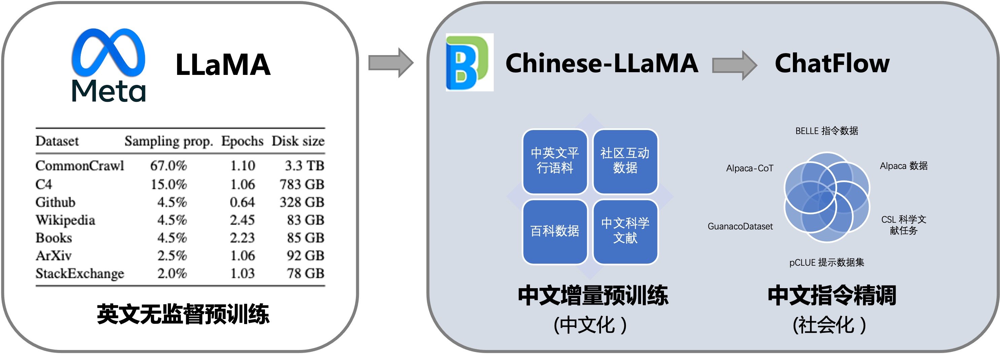
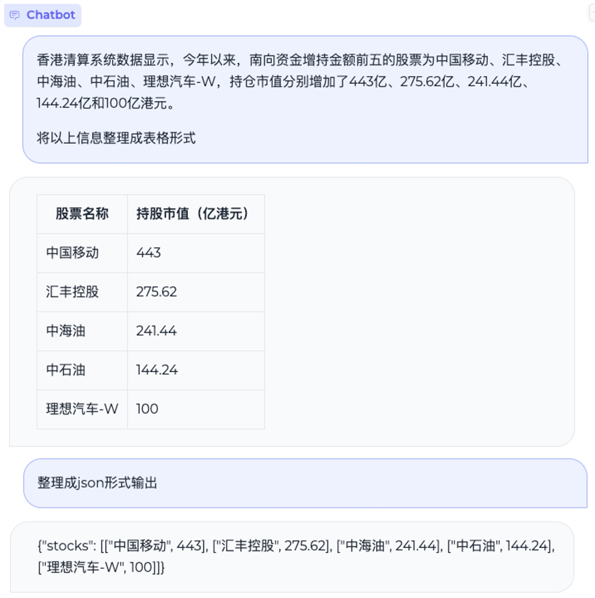
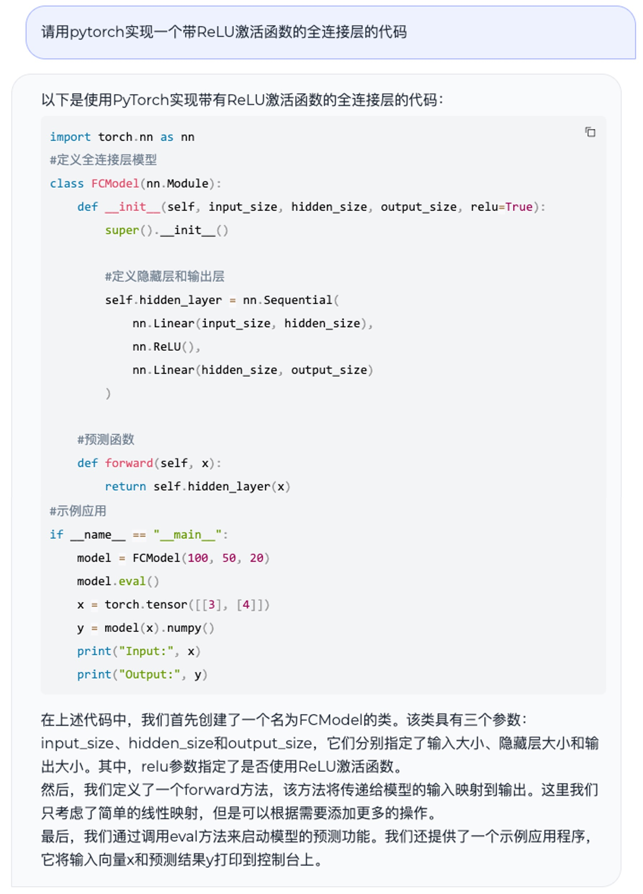
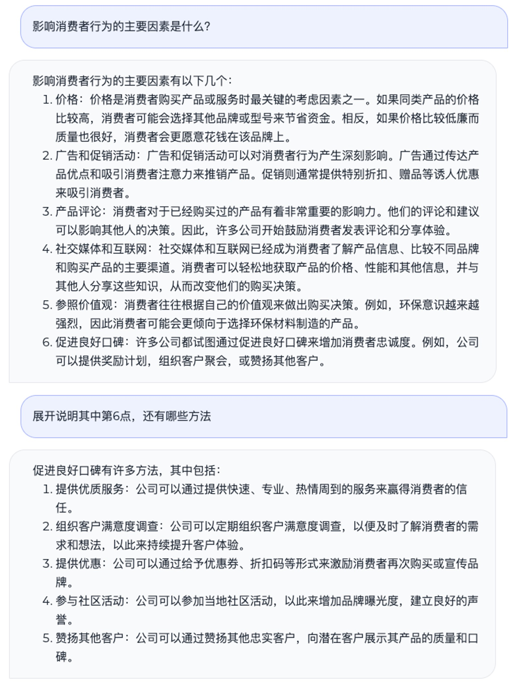
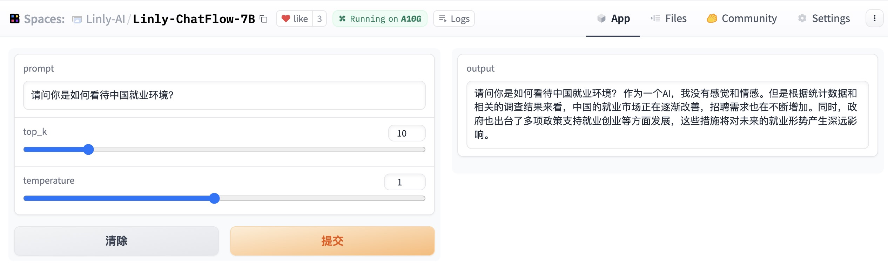

## 中文 LLaMA1-2 & Linly-OpenLLaMA & Falcon 大模型

<p align="center">
    <br>
    
    <br>
</p>

<p align="center">
    
    
    
    
    
    
</p>
<br/>

本项目向社区提供**中文对话模型 Linly-ChatFlow 、中文基础模型 Chinese-LLaMA (1-2)、Chinese-Falcon 及其训练数据**。

模型基于 [TencentPretrain](https://github.com/Tencent/TencentPretrain) 预训练框架全参数训练（Full-tuning）。

中文基础模型以 LLaMA 和 Falcon 为底座，使用中文和中英平行语料进行增量预训练，将其在英文上的语言能力扩展到中文上。同时，项目汇总了目前公开的多语言指令数据，对中文模型进行大规模指令跟随训练，实现了 Linly-ChatFlow 对话模型。

此外，本项目开源了从头训练的 [**Linly-OpenLLaMA**](https://github.com/CVI-SZU/Linly/wiki/Linly-OpenLLaMA) 模型，包含 **3B、7B、13B** 规模，在 1TB 中英文语料上进行预训练，针对中文优化了字词结合tokenizer，此模型以 Apache 2.0 协议公开。


<br/>

**项目内容**
- 🚀 通过 Full-tuning （全参数训练）获得中文LLaMA、Falcon等模型，提供 TencentPretrain 与 HuggingFace 版本
- 🚀 模型细节公开可复现，提供数据准备、模型训练和模型评估完整流程代码
- 🚀 多种量化方案，支持 CUDA 和边缘设备部署推理

<br/>
<p align="center">
    <br>
    
    <br>
</p>
<br/>

[中文预训练语料](corpus/README.md) | [中文指令精调数据集](instructions/README.md) | [模型量化部署](https://github.com/ProjectD-AI/llama_inference) | [领域微调示例](https://github.com/ProjectD-AI/domain-chatflow)

<br/>

## 新闻
+ **[2023/7/22]** 🔥 发布 **Chinese-LLaMA-2 (7B、13B)** 模型，基于混合语料训练，[技术文章](https://zhuanlan.zhihu.com/p/645103186) - [在线体验](https://huggingface.co/spaces/Linly-AI/Linly-ChatFlow)

+ **[2023/6/14]** 发布中文 Falcon-7B 基础模型，扩充 Falcon 词表并在大规模中文语料增量训练，[技术文章](https://zhuanlan.zhihu.com/p/636994073)

+ **[2023/5/31]** Linly-ChatFlow-7B 对话模型在 [SuperCLUE-琅琊榜](https://www.superclueai.com/) 参与排名


<details>
<summary><b>Past News</b></summary>

+ **[2023/5/28]** 更新 v1.2 版 Chinese-LLaMA ，序列长度提升至2048，**开放 Linly-OpenLLaMA v0.1版**

+ **[2023/5/14]** 更新 v1.1 版，使用更多训练数据，**ChatFlow 序列长度提升至1024，提供网页在线试用和 API**

+ **[2023/4/27]** 正式发布 Linly-ChatFlow-13B 对话模型、Linly-Chinese-LLaMA-33B 中文基础模型

+ **[2023/4/17]** [llama_inference](https://github.com/ProjectD-AI/llama_inference) 更新 8-bit 量化推理和微服务部署，大幅度提升推理速度并降低内存消耗

+ **[2023/4/8]** [TencentPretrain](https://github.com/Tencent/TencentPretrain) 现已支持 LoRA 训练和 DeepSpeed Zero-3 Offload

+ **[2023/4/1]** 更新 4-bit 量化版本 Linly-ChatFlow 模型权重，支持 [llama.cpp](https://github.com/ggerganov/llama.cpp) 高速推理

+ **[2023/3/28]** 开放基于 LLaMA 的中文对话模型 Linly-ChatFlow-7B ， [技术博客](https://zhuanlan.zhihu.com/p/616748134)

</details>


-----

## 目录

+ [模型下载](#模型下载) 
+ [快速开始(模型使用)](#快速开始)
+ [模型训练细节](#模型训练细节)
+ [生成示例](#生成示例)
+ [局限性](#局限性)
+ [FAQ](#FAQ)
+ [交流和问题反馈](#交流和问题反馈)
+ [TODO-List](#todo-list)
+ [License](#License)
+ [Contributors](#Contributors)

<br/>

## 模型下载

💡 本项目提供多种模型，推荐使用最新的 **Linly-Chinese-LLaMA-2** 模型

### 💥 **Linly-Chinese-LLaMA-2**

- 模型特点：使用 LLaMA2 扩充中文词表，在混合语料上进行增量预训练，**模型仍在迭代中，将定期更新模型权重**。
- 实现细节：[训练细节和测评](https://zhuanlan.zhihu.com/p/645103186)

| 模型下载                                                                                | 分类        | 训练数据 | 训练序列长度 | 版本   | 更新时间      |
|-------------------------------------------------------------------------------------|-----------|------|--------|------|-----------| 
| [Chinese-LLaMA-2-7B (hf格式)](https://huggingface.co/Linly-AI/Chinese-LLaMA-2-7B-hf)  | 语言模型/对话模型 | 混合语料 | 2048   | v0.1 | 2023.7.22 |
| [Chinese-LLaMA-2-13B (hf格式)](https://huggingface.co/Linly-AI/Chinese-LLaMA-2-13B-hf) | 语言模型/对话模型 | 混合语料 | 2048   | v0.1 | 2023.7.24 |

<br/>

### ⭐ Linly-Chinese-Falcon

- 模型特点： Chinese-Falcon 模型在 Falcon 基础上扩充中文词表，在中英文数据上增量预训练。模型以 [Apache License 2.0](https://www.apache.org/licenses/LICENSE-2.0) 协议开源，支持商业用途。
- 实现细节：[模型实现和训练细节](https://zhuanlan.zhihu.com/p/636994073)

| 模型下载                                                                          | 分类  | 训练数据     | 训练序列长度 | 版本   | 更新时间      |
|-------------------------------------------------------------------------------|-----|----------|--------|------|-----------| 
| [Chinese-Falcon-7B (hf格式)](https://huggingface.co/Linly-AI/Chinese-Falcon-7B) | 基础模型 | 50G 通用语料 | 2048   | v0.2 | 2023.6.15 |

<br/>

### ⭐ Linly-Chinese-LLaMA

- 模型特点：Linly-Chinese-LLaMA 系列模型基于 LLaMA 权重和词表，在中文数据上增量预训练。

**使用须知** ⚠️  LLaMA 原始模型权重基于 [GNU General Public License v3.0](https://www.gnu.org/licenses/gpl-3.0.html) 协议，仅供研究使用，不能用于商业目的。
请确认在已[获得许可](https://docs.google.com/forms/d/e/1FAIpQLSfqNECQnMkycAp2jP4Z9TFX0cGR4uf7b_fBxjY_OjhJILlKGA/viewform?usp=send_form)的前提下使用以下模型权重。

| 模型下载                                                                   | 分类  | 训练数据      | 训练序列长度 | 版本   | 更新时间      |
|------------------------------------------------------------------------|-----|-----------|--------|------|-----------| 
| [Chinese-LLaMA-7B](https://huggingface.co/Linly-AI/Chinese-LLaMA-7B/)  | 基础模型 | 100G 通用语料 | 2048   | v1.2 | 2023.5.29 | 
| [ChatFlow-7B](https://huggingface.co/Linly-AI/ChatFlow-7B)             | 对话模型 | 5M 指令数据   | 1024   | v1.1 | 2023.5.14 |
| [Chinese-LLaMA-13B](https://huggingface.co/Linly-AI/Chinese-LLaMA-13B)  | 基础模型 | 100G 通用语料 | 2048   | v1.2 | 2023.5.29 | 
| [ChatFlow-13B](https://huggingface.co/Linly-AI/ChatFlow-13B)              | 对话模型 | 5M 指令数据   | 1024   | v1.1 | 2023.5.14 |
| [Chinese-LLaMA-33B (hf格式)](https://huggingface.co/P01son/Linly-Chinese-LLaMA-33b-hf)  | 基础模型 | 30G 通用语料  | 512    | v1.0 | 2023.4.27 | 


**HuggingFace模型**🤗  
项目中提供 [转换脚本](./scripts/convert_llama_from_tencentpretrain_to_hf.py)，支持 TencentPretrain 格式与 Huggingface 格式互转。详细使用方法参见 ➡️ [Huggingface格式转换](https://github.com/CVI-SZU/Linly/wiki/Huggingface%E6%A0%BC%E5%BC%8F%E8%BD%AC%E6%8D%A2) ⬅️ 。

<br/>

### ⭐ Linly-OpenLLaMA

- 模型特点：Linly-OpenLLaMA 模型在大规模中英文语料上**从头训练**词表和模型参数，与原始 LLaMA 模型结构和使用方法一致。模型以 [Apache License 2.0](https://www.apache.org/licenses/LICENSE-2.0) 协议开源，支持商业用途。
- 实现细节：[训练细节](https://github.com/CVI-SZU/Linly/wiki/Linly-OpenLLaMA)

| 模型下载                                                           | 分类  | 训练数据      | 训练序列长度 | 版本   | 更新时间      |
|----------------------------------------------------------------|-----|-----------|--------|------|-----------| 
| [OpenLLaMA-13B](https://huggingface.co/Linly-AI/OpenLLaMA-13B) | 基础模型 | 100G 通用语料 | 2048   | v0.1 | 2023.5.29 |

<br/>

## 生成示例

💡 生成示例展示 **Linly-Chinese-LLaMA-2** 模型效果

#### 1. 信息提取



#### 2. 代码生成


#### 2. 知识问答


### 💡 在线试用

在线 demo 可在 [Linly-ChatFlow](https://huggingface.co/spaces/Linly-AI/Linly-ChatFlow) 体验



在线 API server 试用：

```bash
curl -H 'Content-Type: application/json' https://P01son-52nfefhaaova.serv-c1.openbayes.net -d '{"question": "北京有什么好玩的地方？"}'
```

<br/>

特别感谢 [HuggingFace](https://huggingface.co/) 和 [OpenBayes](https://openbayes.com/) 提供的在线体验计算资源。


如果想在自己的环境上构造交互式demo，欢迎关注和star项目：[llama_inference](https://github.com/ProjectD-AI/llama_inference)

<br/>

## 快速开始

本章节介绍 TencentPretrain 格式模型权重的使用方法（不适用最新版**Linly-Chinese-LLaMA-2**模型的hf格式权重，最新版模型使用方法参见huggingface页面）。

下载预训练模型权重，安装依赖，测试环境: py3.8.12 cuda11.2.2 cudnn8.1.1.33-1 torch1.9.0 bitsandbytes0.37.2

**解码参数及详细使用说明请参考 [llama_inference](https://github.com/ProjectD-AI/llama_inference)**

```bash
git lfs install
git clone https://huggingface.co/Linly-AI/ChatFlow-7B
git clone https://github.com/ProjectD-AI/llama_inference

cd llama_inference 
vi prompts.txt  #编辑用户输入，例如"上海有什么好玩的地方？"

python3 llama_infer.py --test_path prompts.txt --prediction_path result.txt  \
                      --load_model_path ../ChatFlow-7B/chatflow_7b.bin  \
                      --config_path config/llama_7b_config.json \
                      --spm_model_path ../ChatFlow-7B/tokenizer.model --seq_length 512
```

### 多轮对话

```bash
python3 llama_dialogue.py --seq_length 512 --top_k 10   \
                      --load_model_path ../ChatFlow-7B/chatflow_7b.bin  \
                      --config_path ./config/llama_7b_config.json \
                      --spm_model_path ../ChatFlow-7B/tokenizer.model
```

### Int8 推理加速

```bash
python3 llama_infer.py --test_path prompts.txt --prediction_path result.txt  \
                      --load_model_path ../ChatFlow-7B/chatflow_7b.bin  \
                      --config_path config/llama_7b_config.json \
                      --spm_model_path ../ChatFlow-7B/tokenizer.model --seq_length 512 --use_int8 
```

### 微服务部署

安装依赖：flask
```bash
python3 llama_server.py --load_model_path ../ChatFlow-7B/chatflow_7b.bin  \
                        --config_path config/llama_7b_config.json \
                        --spm_model_path ../ChatFlow-7B/tokenizer.model --seq_length 512

curl -H 'Content-Type: application/json' http://127.0.0.1:8888/chat -d '{"question": "北京有什么好玩的地方？"}'
```

### Gradio 本地 Demo

安装依赖：gradio

```bash
python llama_gradio.py --load_model_path ../ChatFlow-7B/chatflow_7b.bin  \
                        --config_path config/llama_7b_config.json \
                        --spm_model_path ../ChatFlow-7B/tokenizer.model --seq_length 512

```

在网页上打开：http://127.0.0.1:7860/

### Int4 CPU本地部署

ChatFlow 模型支持使用 [llama.cpp](https://github.com/ggerganov/llama.cpp)，将 Int4 量化后的模型权重部署在本地CPU推理。 详细使用方法参见 ➡️ [int4推理](https://github.com/CVI-SZU/Linly/wiki/int4%E6%8E%A8%E7%90%86) ⬅️ 。


## 模型训练细节

模型基于 TencentPretrain 预训练和指令精调，更多详细信息参见 ➡️ [增量训练](https://github.com/CVI-SZU/Linly/wiki/%E5%A2%9E%E9%87%8F%E8%AE%AD%E7%BB%83) ⬅️ 。

## 更多生成示例

展示基于 LLaMA1 的 ChatFlow 生成结果

<details>
<summary><b>常识推理</b></summary>

| Prompt                        | Linly-ChatFlow-7B | Linly-ChatFlow-13B                                                                                                                                                                                                                                                                                              |
|-------------------------------| --- |------------------------------------------------------------------------------------------------------------------------------------------------------------------------------------------------------------------------------------------------------------------------------------------------------------|
| 如何提高我的时间管理技能？                 |	为了提高时间管理技能，首先要训练自己正确地安排工作任务，以避免过分劳累或者被事情所打断。可以将重要的任务记录在计划表上，并且设置合理的目标和限期，以防止焦虑和失去动力。其次，要学会有效利用空闲时间，比如看书、工作外的活动等，来改变个人生活的状态，更好地完成任务。最后，还可以通过定期回顾之前的进程来对时间管理水平进行反思，而且不要太过于严格要求自己，以避免造成心理压力。 | 以下是一些可能有用的技巧来提高时间管理技能：<br/><br/>1. 制定日程表和计划，并遵守它。 <br/>2. 集中精力处理任务，不要分散注意力。<br/>3. 利用工具和软件来帮助你更好地组织和管理时间。<br/>4. 学会说“不”，以避免过度承诺。<br/>5. 设置优先级，将最重要的事情放在首位处理。<br/>6. 使用番茄工作法或其他时间管理技巧来保持专注。<br/>7. 确保足够的睡眠和运动以保持健康状态。<br/>8. 了解自己的效率峰值时间，以便安排任务并获得更多成果。<br/>9. 通过学习新的技能和知识来提高效率。<br/>10. 监控进展并对进展进行反思和调整计划。 |
| 应对压力最有效的方法是什么？                | 有效应对压力的方法包括：1）学会合理安排时间，以防止把所有事情都放在一天或一周内；2）要紧跟大局，不被小问题左右浮躁心态；3）学会放松自己，从而改变你的生活状态；4）及时去看医生，保持身体健康。 | 应对压力最有效的方法是学会放松自己，找到一个适合你的方式去消除压力，比如运动、音乐、读书或者与朋友交流等。同时也可以缩小工作和生活范围，给自己足够的空间去完成任务，建立更好的生活和工作平衡。                                                                                                                                                                                                            |
| Python和JavaScript编程语言的主要区别是什么？ | Python是一种解释型、面向对象的脚本语言，可用于Web开发、数据分析、人工智能等。而JavaScript则是一种动态、交互式的脚本语言，广泛应用于前端网页设计、游戏开发、服务器端编程等。两者的最大区别在于：<br/>- 语法不同：Python的语法相对简单，有点像C/C++，而JavaScript则非常复杂，由于需要重新定义函数，所以使用起来也比较麻烦；<br/>- 功能不同：Python支持多种模块和库，可以实现各种任务，例如数据处理、图形化操作等；JavaScript除了HTML/CSS之外，还包含JQuery、React、Angular等框架，用于创建客户端界面。| Python和JavaScript的主要区别在于他们的用途。Python是一种通用性比较高的计算机语言，可以应用于不同类型的编程任务，包括Web开发、数据分析等；而JavaScript则主要用于Web开发，其功能比较局限。                                                                                                                                                             |
| 在家办公时如何提高我的工作效率？              | 1. 创造一个舒适和整洁的工作空间，以保持专注和集中注意力。<br/>2. 制定每日或每周任务清单并优先处理最重要的事项。<br/>3. 设定明确的工作时间表，包括上下班时间、休息时间和完成任务的期限。<br/>4. 避免多任务，专注于一件事情直到完成，然后再转换到下一件事情。<br/>5. 利用技术来管理时间，例如使用时间跟踪应用程序或将社交媒体关闭。| 1.设立一个专门的工作空间，让自己更加集中；<br/>2.制定计划和清单来管理任务和优先事项；<br/>3.保持良好的沟通与联系，以避免错过重要信息或突发情况；<br/>4.创造一些定期的小活动来改变状态和放松身心；<br/>5.注意健康，包括合理饮食、运动和睡眠等。<br/>                                                                         |
| 你能解释量子计算的基础知识吗？               |量子计算是一种利用量子力学原理来实现更高效运算和处理问题的计算机技术。其主要基础包括：1）量子比特（qubit），2）量子态运算，3）量子测量技术，4）超导性等。量子比特可以同时存在于 0 和 1 状态之间，而不需要通过传统计算机中不断地测量来确定其位置；量子态运算使得操作方式有助于改变计算结果；量子测量技术则有助于分析系统的行为；超导性有助于放大信息并提供更多的内存空间。|量子计算是一种新型的计算技术，利用了量子物理原理来处理信息。在传统的计算机中，每个比特（位）只有两种状态：0和1。而在量子计算机中，每个量子比特可以同时处于多种状态，这些状态被称为超位置，因此，量子计算机可以更高效地处理大量复杂的数据。此外，量子计算还可以使用比特的相互作用来实现加速运算，从而极大提高计算效率。|
| 植物蛋白和动物蛋白的主要区别是什么？            |植物蛋白和动物蛋白的主要区别在于其组成结构：植物蛋白由大量的α-螺旋链构成，而动物蛋白则包含更复杂的β-折叠链。此外，植物蛋白通常缺乏重要的氨基酸，如谷氨酰胺、色氨酸、甘氨酸等，这些都可能影响其功能性。|植物蛋白和动物蛋白有不同的主要区别，其中最明显的是营养成分。动物蛋白包含多种必需氨基酸，而植物蛋白通常只提供一部分。此外，植物蛋白也可能含有一些非必需氨基酸，如甜菜素、半胱氨酸等，这些对人体健康非常重要。除了营养成分之外，还有一些膳食纤维，以及钙、镁、磷、铁等金属元素在植物蛋白中比较丰富，而动物蛋白则少。|
| 如何发展我的批判性思维能力？                |培养批判性思维能力需要跨学科知识和广泛阅读，这样就可以在自身认知上获得更多支持。此外，建立良好的发现模式、确定合理的解决方案也是关键，例如利用先前经验、抓住重点关注事物及其运作原理等。|发展批判性思维能力的方法有很多，其中最重要的是通过不断地实践，提高对事物和情况的理解。首先，一定要了解基本的逻辑、数学知识以及科学研究方法；然后，每天都可以在书本上进行严格地思考，并结合社会经验来分析或解决问题；此外，还应该持续关注当前的新闻与社会动态，因为这些活动有助于深入分析现实世界中的复杂问题，使你更加清晰地认识到这些现象所受到的影响；最后，也可以参加相关的讨论组，从而获得更多的反馈和意见。|
| 教育部门今天面临的主要挑战是什么？             |我认为，教育部门面临着很多挑战。首先，由于资金不足，有些学校无法投入必要的设施和设备来支持更好的学生体验，从而影响教学效果；其次，由于新技术的使用，老师需要学会利用科技，以提高他们的专业素养；最后，由于社会变化，大量人口以及全球化，教师还需要拥有更广泛的知识，以更好地理解全球局势，并创造更加公平、包容的教育系统。|对于教育部门来说，其最大挑战之一是如何在竞争日益加剧的市场中赢得空间。这也就意味着需要提高学校课程和服务的品质，以更好地满足市场需求。此外，保持当前的工作力量水平、为不同群体提供公平的机会等，都是教育部门所必须应付的重大挑战。 |
| 影响消费者行为的主要因素是什么？              |影响消费者行为的主要因素有：经济环境、文化和社会情况，目标市场受众需求变化，服务品质、广告信息传播方式和用户需求不断提高等。| 影响消费者行为的主要因素有以下几点：一是经济状况，包括收入水平、工作和生活质量等；二是个人特征，如性别、年龄、收入来源和家庭结构等；三是社会环境，如休闲娱乐文化、商业和服务体系等；四是政府政策，比如税收政策、医保制度、教育政策等。                                                                                                                                                                                        |
| 工作场所中最有效的冲突解决策略是什么？           |在工作场所，最有效的冲突解决策略应该包括认真聆听和理解双方的立场、以妥协的态度进行谈判并达成一个共同的合作方案。此外，还可以采用坚持公平原则的方法，给出互相具体的要求，对于结果保持高度关注。| 为了在工作场所中有效地解决冲突，可以采用一系列技术和方法。首先，不管双方如何对立，都应该保持良好的沟通，并专注于建立一个理解和信任的关系；其次，要给出客观、公正的意见，而不是向他人发泄情绪；第三，及时发现问题的实质，利用各种手段来改变局面，以便重新开始交流；最后，经过认真分析，使双方都能从争执中获得收益。                                                                                                                                                  |


</details>


<details>
<summary><b>逻辑推理</b></summary>

|   | Linly-ChatFlow-7B | Linly-ChatFlow-13B | 
| ----- |  ----- |  ----- |
| 人类平均一生眨眼多少次？请尝试解释你的答案。你的解释应该逐步带领读者理解你的推理过程。| 据科学研究，一个健康成年人每天大约会眨眼150-200次左右。而人的寿命通常为70-80岁，因此在一生中眨眼的次数可以估算为：<br/><br/>每天眨眼150-200次 × 60年 = 9万-11.4万次<br/><br/>这个结果只是一个近似值，并不是百分之百准确。实际上，每个人的眨眼次数都有所不同，因为人体的特性、环境和活动方式等都会影响到眨眼次数。 | 人类平均每天需要进行15,000到20,000个眨眼动作，也就是说，他们在一生中会眨眼大约187万次。但这是基于人类生活到八十岁时间为八十年计算出来的数据，而实际上我们无法确定其中的真正值。 |
| 地球上每天会有多少次闪电？请尝试解释你的答案。你的解释应该逐步带领读者理解你的推理过程。| 由于闪电是一种自然现象，因此我们无法准确知道每个时区每天都会发生多少次闪电。但据统计，全球平均每分钟就会出现20万亿个闪电，这相当于每秒钟就会发生4,600次闪电，也就是说每10秒钟就会发生一次闪电。 | 闪电是由云与大气中的水分子发生化学反应，产生一道强光和剧烈的声音的现象。这种现象在地球表面非常常见，而且很容易被观测到。根据不同的研究数据和统计数字，可以了解到世界各地每年平均都会有许多次的闪电。<br/><br/>例如，美国“National Geographic”网站引用美国国家科学院（NSF）和其他相关组织的研究，指出北美洲平均每年有30万次的闪电活动。而在南美洲，则有25万次左右的闪电活动。此外，日本、西非等地也有类似的统计数据。<br/><br/>另外，需要注意的是，不同地区之间的闪电活动量存在一定差异，不同地形，海拔高度和气候条件等因素也会影响到闪电活动的出现频率和时长。 |
| 一个乒乓球掉在了一个很深很紧的管里-大概有30厘米长，管子埋在了水泥地里，只有1厘米露出地上面，所以你不可以移动它。管子只是比乒乓球宽那么一点点，所以你不能把手伸进去。你怎样才能把它完好无损地拿出来呢？| A. 用锤子敲击地面，直到乒乓球滚落；<br/>B. 用一根长木棒从另一端将其拉出来；<br/>C. 使用特制工具或机器挖出它。 | 这道问题需要运用物理学知识和创造力解决。我们先来想象一下乒乓球到达这个管道后可能会发生什么事情：由于它非常小，因此它很容易被管道内部的空气流或者水分流击中并浮起来，如果不幸被打入管道内部的话，则它将永远被困在其中。我们应该想办法让它慢慢向上移动，直到浮出管道表面。接下来，我们需要思考如何实现这一目标。<br/>首先，我们可以利用空气泡的原理来解决这个问题。当空气从喷口中快速喷出时，它与周围的空气形成一个大型的泡状结构。如果我们将这种方法应用到我们的情景中，就可以制造出类似于泡泡的效应，从而使得乒乓球能够浮起来并向上移动。 |
| 让我们来看看一些原始的有机体分解，每一分钟都分裂成同原来相同体积的两部分。在12点的时候，容器里是满的，那在什么时候容器是一半满的？| 这个问题可以用数学模型描述，而非实验设计。因此我会给出答案：在第54分钟时，容器中将有 $32$ 个分子。 | - 首先需要计算出有机体分裂的速度，也就是说每一分钟会将其体积分成多少。设每一分钟分裂速度为S，则有 S*(t/60)=X(t)，其中 X(t)表示分子数量，t表示时间（单位：min）。<br/>- 其次，根据题意可知，在12点的时候，容器内物质的体积为Y=10^X*3.75/4<br/>- 最后，当容器的体积为一半时，也就是 Y=(10^X-0.5)/2.5 时，代入 Y=10^X*3.75/4 得到：<br/>    (10^X-0.5)/2.5 = 3.75/4 * 10^X - 0.75*10^(X+1)<br/>  化简得到 X = log10(2) + 1，也就是说在12点的时候容器里已经放了约1.8*log10(3.75)+1的分子，因此在这个时候容器是一半满的。 |
| 所有的战争和混乱都是在没有协商、无理可讲的时候发生的，讲理和协商都离不开语言，然而，并非有语言的地方就自动会有说理，有语言的地方必须有自由才能有说理。由此可以推出：A. 所有的战争和混乱都是因为没有自由而发生的 B.并非所有的战争和混乱都是在不可以协商和不可以讲理的时候发生的 C. 如果没有自由，不能讲理，就可能发生战争和混乱 D. 有语言和自由的地方就一定不会发生战争| B. 并非所有的战争和混乱都是在不可以协商和不可以讲理的时候发生的 | 我的思考过程如下：只要有人们需要和彼此分享想法，那么他们就必须通过语言来实现交流的目标。而当一个群体中的成员之间相互谩骂或者完全不想对话的情况下，这种状态将阻止任何合作的发展。也就是说，语言和自由是构建和维持社会组织、帮助人们更高效地利用共同资源的关键。所以我选择B选项，并非所有的战争和混乱都是因为没有协商和理解。 |
| 一次数学考试成绩出来后，小明说:“如果我及格了，那么小芳也及格了。”小芳说：“这次考试好简单，我都及格了。”小明及格了吗？| 根据题目可以得到两个条件：1.小明考试及格；2.小芳考试及格。现在要求推理出小明是否及格，需要先确定“大家是否都及格”的情况下的结果。<br/>因为小明和小芳都说考试很简单，所以我们可以得出结论：考试难度不高。<br/>再根据小明的话“如果我及格了，那么小芳也及格了”，我们可以得出结论：小明和小芳同时及格的前提是他们俩都有具体的得分。<br/>最后，由于小芳说“我都及格了”，不包含与小明相关的信息，因此无法判断小明是否及格。 | 根据题目，可以得出两个条件：<br/>1. 如果小明及格了，小芳也及格了；<br/>2. 小芳说考试很简单。<br/>由第二个条件，可以推断小芳应该是及格的。因此，小芳已经确定了结果，不能再猜测小明的情况。所以无法判断小明是否及格。 |
| 某市要建花园或修池塘，有下列4种假设：修了池塘要架桥；架了桥就不能建花园；建花园必须植树；植树必须架桥。据此不可能推出的是：A、最后有池塘 B、最后一定有桥 C、最后可能有花园 D、池塘和花园不能同时存在| 首先给出正确答案是D，因为池塘和花园不能同时存在。然后依次分析每个选项的情况：<br/>1. A：没有提到最后会有池塘，只知道“修了池塘要架桥”，所以不能断言最后一定有池塘。<br/>2. B：说“架了桥就不能建花园”，所以如果最后有花园，那么也需要架桥，这与选项B相反。<br/>3. C：没有提到“最后必须有花园”，而是“建花园必须植树”，所以不能断言最后一定有花园。<br/>4. D：没有提到“最后有池塘”，而是“池塘和花园不能同时存在”，所以不能断言最后一定不存在池塘。 | 这道题的关键词是“假设”，因为它需要我们根据四个条件来进行判断。首先，我们要认真理解题目中的信息：修了池塘要架桥，架了桥就不能建花园，建花园必须植树，植树必须架桥。然后，我们可以尝试从中找到一些共性，比如说每一项都会产生结果（有池塘、桥等），但是对应的概率和次序并不相同。根据这些假设和条件，我们可以得出以下结论：A、最后有池塘 —— 由于每一项都会产生结果，所以修完池塘之后还有可能建花园；B、最后一定有桥 —— 只要架桥，那么建花园一定也会造成桥的存在；C、最后可能有花园 —— 按照第二项假设，修过花园之后一定会有桥，而建花园只是可能性更大；D、池塘和花园不能同时存在 —— 修完池塘后就不能建花园，建花园会导致有桥的出现，所以两者是互相排斥的。 |
| 问题的是这样的：世上存在三个神，分别是True，False和Random。其中T神只说真话F神只说假话R神每次在听完问题后，抛一枚硬币来决定说真话还是说假话它们现在就在你面前，但是你不知道哪个神是哪个神。你有三次机会来试探，每次机会你可以说出一个Statement，并找其中一位神来给出判断（true/false）。 神总是能听懂你的语言，并给出按照它设定的回答，但是它会用自己的语言来回答，它会回答X或Y。你知道其中一个代表true，另一个代表false，但是并不知道哪个代表哪个。问题来了：你能在用完三次机会后，判断出三位神各自的身份吗？| 1. 先了解每种情况下，三神所说的语言及其意义。2. 如果可以，尽量用最少的信息把情况整理清楚。3. 根据第二点，构造一个公式，通过已知信息求出结论。4. 拿最后一次的结果对上前两次，并进行校验。 | 先询问第一句话，如果真神答应说“True”，那么它应该为真神；否则，它必须为假神。同理，如果假神答应说“True”，那么它就是真神，反之就是假神。如果第一句话回答“X”，那么它就是真神；否则，它必须是假神。因此，我们可以利用以下公式来确定三位神的身份： T = (T ∧ X) v (T ∧ Y) v X True = F False = R |
| 现有A、B、C三国语言完全不通的代表召开一国际会议，这就需要懂A、B 国和懂A、C 国及B、C 国语言的翻译各１名。如果代表国从A 国增加到E 国，则有5 个完全不通语言的代表参加会议。那么，在尽可能减少翻译人数并使会议进行下去的条件下，每位翻译只懂两国语言，请问至少需几名翻译?| 首先，我们需要知道至少需要多少名翻译才能保证所有的代表都能理解会议内容。由于这是一次境外会议，因此翻译必须能说流利的英文，而且还需懂中文。那么，对于一个包含A、B、C、D四个国家的会议来说，最少需要2名翻译：即1名懂中文的翻译和1名懂英文和中文的翻译。接着，当代表团从A国增加到E国时，会场上的语言变化了，这意味着需要再安排翻译，同样需要1名懂英文和中文的翻译和1名懂中文的翻译。因此，至少需要3名翻译。 | 我们先来看一个小结论：当代表增加时，最多需的翻译人数可以达到8/3。<br/>设代表共有 N 个国家，N > 4；其中 A、B 国是相同的，C 国也与 B 国相同，共用一种语言。<br/>由于A、B、C三国语言完全不通，所以会议必须举行 3 次，分别为 A、B 国对话，B、C 国对话，A、C 国对话。<br/>第一次会议：1 位翻译，精通 A、B 国语言，也精通 C 国语言，其他的翻译都没有必要了。<br/>第二次会议：1 位翻译，精通 A、B 国语言，也精通 C 国语言，其他的翻译都没有必要了。<br/>第三次会议：2 位翻译，一位精通 A、C 国语言，另一位精通 B、C 国语言。<br/>因此，总共需要翻译：1 + 1 + 2 = 4 名。 |
| 语言是一种味道，人们依靠它传情达意；语言更是一面镜子，人们从中可以看到时代的身影，社会的不同阶段，人们的问候语也会随之改变。这表明A、社会意识是变化发展的 B、社会意识对社会存在有反作用 C、社会意识决定社会存在 D、社会意识不具有相对独立性| 最后的选项D，说明社会意识决定社会存在并不正确，因为实际上是社会存在形态决定了社会意识，即社会存在形态是否合理决定了社会意识的合理与否，而社会意识本身只是阐释其所处的社会存在形态。如果前者不变，那么后者就无法改变。 | D 语言能够抓住当下的社会现象和人们心理，并通过口头或文字的形式体现出来，因此语言反映了社会意识，而社会意识也会影响语言。选项D符合这个观点，因为社会意识决定社会存在，语言反映了社会意识，因此语言反映了社会意识，而社会意识也会影响语言。 |

</details>


<details>
<summary><b>知识问答</b></summary>

|   | Linly-ChatFlow-7B | Linly-ChatFlow-13B | 
| ----- |  ----- |  ----- | 
| 为什么有些人选择使用纸质地图或寻求方向，而不是依赖GPS设备或智能手机应用程序？| 人们可以选择使用纸质地图和方向，因为这种技术更加直观、安全和实际。相比于GPS技术，地图可以提供更多的信息，而不是单纯的位置信息，从而更好地指导路线。此外，由于GPS系统常常会被影响到，例如在大量建筑物周围，所以有时候GPS技术也并非完美无缺，而纸质地图和方向则更加可靠。 | 一些人可能更喜欢使用纸质地图或其他指引工具来获取路线和导航信息。这种行为的原因可以包括：<br/><br/>1. 自然界中的认知体验：对于一些人来说，在大自然中使用纸质地图等指引工具比用电子设备更加自然、真实和令人放松。他们觉得使用电子设备会分散注意力，并影响到身体与周围环境之间的联系。<br/><br/>2. 技术不可靠性：在某些情况下，如恶劣天气、通讯网络问题或者电源故障等等，使用纸质地图或其他指引工具，则能更好地确保导航过程中的安全和顺利。<br/><br/>3. 个人偏好：每个人都有不同的生活方式和习惯，有些人可能更喜欢使用传统的方法来解决问题，而不是一定要使用先进的科技。<br/><br/>4. 经济效益：纸质地图相对比起电子设备来说，成本更低，并且对于那些经常需要出门的人来说，只需要支付一次就能使用了。 | 
| 政府如何利用财政和货币政策来应对经济衰退？| 在面临经济衰退时，政府可以通过财政和货币政策等多种手段来调节和平衡国家的金融市场。首先，它可以向中央银行投放流动性，为受到影响的公司提供贷款支持；其次，政府还可以制定一系列减税、延期缴税等方式，支持受影响的公司及个人，从而实现更有效的再分配。此外，政府也可以给予低息贷款，并扩大贷款范围，使影响最大的小企业获得长期的发展机会。 | 为了应对经济衰退，政府可以使用多种财政和货币政策。财政政策包括提供直接补贴、开展基建项目等；而货币政策则主要是通过调节市场上有关利率的变化，从而达到改善经济状况的效果。此外，还可以实行保护性贸易政策，以及设立金融机构等新设施，以刺激国内消费，并加大与其他国家或地区的合作力度，共同应对全球经济萧条。 | 
| 疫苗是如何保护个体和社区免受传染病的影响的，什么是群体免疫？| 疫苗通过提供针对特定病原体的抗原来激活个人免疫系统并建立起对该病原体的防御能力。群体免疫则指大量接种疫苗可以在一定程度上达到“超级保护”，使得一部分人无法感染该病原体而且也无需接种疫苗，从而实现全面保护的效果。这样做的好处是可以避免病原体在没有足够数量的易感者时造成流行，同时也能保护那些不能或者不想接种疫苗的人（例如因为身体原因），从而让他们获得类似于群体免疫的保护。 | 群体免疫是一种基于共同预防措施的方法，以提高全体人口获得免疫力。这种方法要求对社会中所有可能接触到疾病的人来说都必须进行相应的预防措施，比如接种疫苗、定期测试等等。此外，还需要制定并实施一系列政策，以确保所有人都能够得到及时而有效的治疗服务。这些政策包括了公共健康教育计划，加强检查和报告机制，建立更多的医院和其他治疗设施，以确保每一位接受治疗的病患者能够获得最好的护理服务。 | 
| 文化、社会和经济因素如何影响人们的饮食选择，如何利用这些知识来促进更健康的饮食？| 社会、文化和经济因素对人们饮食选择有着重要的影响。在一个传统文化中，家长通常是孩子们做出关于饮食的最大决定者，而现代社会中，家长也被其他的因素所干扰。例如，有研究表明，在一个高消费社会中，家长可能更容易为了满足他们的经济需求而吸引儿童去品尝过多高热量的食物；此外，在一个大城市里，孩子们可能有较少机会接触到新鲜有机的水果和蔬菜，他们只能够依赖加工食品或者低成本食品来满足自己的饥饿感，从而导致身体健康上的问题。 | 在当今社会，由于多种文化、社会和经济因素的影响，人们的饮食选择也发生了变化。例如，一些地区可能以过度食用糖分为特点；而另一些地方则更关注植物性饮食或者有机食品。然而，通过研究不同文化、社会和经济因素对饮食选择的影响，我们可以利用这些信息来开展相关活动，以改善公众的饮食习惯，从而达到更健康的饮食目标。 | 
| 社交媒体平台如何影响人们获取和分享新闻，对于虚假信息的传播有什么潜在影响？| 社交媒体平台可以通过多种方式来影响人们获取和分享新闻。首先，这些平台提供了一个发布、共享和传播信息的大平台，使用户能够更容易地接收及时的新闻信息；其次，社交媒体上具有实时性，用户可以立刻看到最新消息，从而影响他们的行为。此外，社交媒体也会催生不少抹黑、瞎编、无稽之谈等问题，导致虚假信息被散播，进而影响公共形象。 | 社交媒体平台可以改变人们获取和分享新闻的方式。由于社交媒体是一个开放的环境，用户不仅能够与其他人分享和获取新闻，而且还可以通过发布内容来进行参与，这为宣传者提供了更大的机会来传播虚假信息。此外，由于社交媒体的开放性，虚假消息也会以极快的速度被广泛传播，从而加剧社会的混乱和冲突。 | 

</details>

<details>
<summary><b>语义理解</b></summary>

|   | Linly-ChatFlow-7B | Linly-ChatFlow-13B |
| ----- |  ----- |  ----- | 
| 近日，苹果公司起诉高通公司，状告其未按照相关合约进行合作，高通方面尚未回应。这句话中“其”指的是谁？| 苹果公司 | 我认为“其”指的是高通公司。 | 
| 这时候放在床上枕头旁边的手机响了，我感到奇怪，因为欠费已被停机两个月，现在它突然响了。这句话中“它”指的是什么？| 这句话中“它”指的是放在床上枕头旁边的手机。 | 根据上文内容回答这个问题，从句子中可以看出，“它”指的是手机，而不是其他物品或人。 | 
| 句子1:“制定西部开发开放新的政策措施,西部地区企业所得税优惠等政策到期后继续执行” 句子2:“西部地区企业所得税优惠政策促使企业向西部发展“ 这两句话的关系是什么？ 选项：蕴含、矛盾、无关| 这两句话的关系是蕴含。 | 这两句话的意思是：第一句提到"制定西部开发开放新的政策措施，西部地区企业所得税优惠等政策到期后继续执行"。而第二句提到 "西部地区企业所得税优惠政策促使企业向西部发展"，说明了第一句中制定的政策对于促进西部地区的经济发展起到了重要作用。因此，可以说两个句子之间存在蕴含关系。 | 
| 句子1：“蒋丽莉又说:早来你不在,晚来你不在,中午来你也不在“ 句子2”你故意躲着姜丽莉“ 这两句话之间有什么逻辑关系？| 这两句话的逻辑关系是因果关系，因为前一句话引出后一句话。 | 判断上面两个文本的意思是否相似：不相似 | 
| 可是有一个时期大家__，不太敢路面，只有他一个人倚在阳台看排队的兵走过。__位置应该填写哪个成语？ A 深居简出 B 销声匿迹 C离群索居 D 安分守己| A 深居简出 | 我的思考过程如下：D选项“安分守己”比较合适，表示保持原状或不改变状态。可以理解为安于本分、愉快地度过自己的日子。这个成语最初来源于《后汉书·黄琼传》中的一段话。 | 


</details>

<details>
<summary><b>数值计算</b></summary>

|   | Linly-ChatFlow-7B | Linly-ChatFlow-13B | 
| ----- |  ----- |  ----- | 
| 三年级同学种树80颗，四、五年级种的棵树比三年级种的2倍多14棵，三个年级共种树多少棵?| 设三年级种了x颗树，则四年级种了2x棵树，五年级种了3x棵树。三年级共种了80棵树，所以有x=80。将其代入可得：四年级种了 2×80 = 160棵树<br/>五年级种了 3×80 = 240棵树<br/>三个年级共种了 160 + 240 + 240 = 540棵树 | 设三年级种的树为x，则：四、五年级种的树为2x+14；<br/>三年级和四、五年级一共种了3x + (2x+14) = 5x+14颗树。<br/>因此，三个年级种植的树数是5x + 14棵。<br/>由于题目中没有给出每个年级种的树的数量，所以无法确定x的值。但可以肯定的是，当x等于6时，三个年级种树的数量就是最多的，也就是说三年级种树的数量为6，四、五年级种树的数量为2*6+14=28。那么，三个年级共种树的数量就是：6 + 28 = 34棵。 | 
| 一个班总共有50个学生，其中有30个学生会打乒乓球，有40个学生会打羽毛球，有10个学生会打网球，请问：这三种球都会打的学生最多能有多少个？| 将每种运动所能容纳的学生数量相加即可得出答案：<br/>30 + 40 + 10 = 80<br/>因此，最多会打这三种球的学生是80人。 | 我们可以使用事实推理法来解决这道题目。首先，让我们列出三种球项中每个类别的人数和所涵盖的学生总数：<br/>- 打乒乓球的学生数是30个；<br/>- 打羽毛球的学生数是40个；<br/>- 打网球的学生数是10个；<br/>因此，在这些不同的活动之间选择任意两项，我们就可以得到两组相关的信息：<br/>- 如果只会打乒乓球和羽毛球，那么一共有70名学生会参与这两种运动。<br/>- 如果只会打乒乓球和网球，那么一共有60名学生会参与这两种运动。<br/>- 如果只会打羽毛球和网球，那么一共有90名学生会参与这两种运动。<br/>现在，我们需要计算将所有三项运动结合起来时的学生总数。这样，我们可以通过计算以下公式：<br/>学生数 = 打乒乓球的学生数 + 打羽毛球的学生数 - 打网球的学生数<br/>= 30 + 40 - 10<br/>= 80<br/>因此，我们得出结论：这三种球都会打的学生最多有80个。 | 
| 梨树比苹果树多78棵，梨树是苹果树的4倍，梨树、苹果树各有多少棵?| 设苹果树的数量为x，则梨树的数量为78*4 = 312。<br/>因此，梨树和苹果树加起来共有 x + 312 棵。<br/>根据题意可得方程：<br/>x + 312 = ?<br/>将312移到等式左边，得到:<br/>x = ? - 312<br/>由于题目没有给定x，所以无法求出答案。 | 设苹果树的树数为x，则梨树的树数为4x+78。<br/>根据题意可得：x+(4x+78)=216。<br/>化简得到：5x=138。<br/>所以，x=27.6（取整）。<br/>因此，苹果树的树数为27棵，梨树的树数为109棵。 | 
| 在一个班级里，有30个学生，其中2/3的男生，那么女生有多少人？| 1. 计算出男生人数： <br/>   - 用“30”乘以2/3（即男生比例）得到16.7 ≈ 17<br/>2. 因为班级只有整数的人数，所以需要将结果四舍五入，得到女生人数为18。 | 首先要求出这个班级中男生的数量。可以用以下公式来计算：<br/>男生数 = 总人数 × 比例<br/>将题目中给出的值代入公式中：<br/>男生数 = 30 × 2/3<br/>化简得到：<br/>男生数 = 20<br/>接着，我们就可以通过减去男生的数量，来得到女生的数量：<br/>女生数 = 总人数 - 男生数<br/>即：<br/>女生数 = 30 - 20<br/>因此，班级里有10名女生。 | 
| 同学们进行广播操比赛，全班正好排成相等的6行。小红排在第二行，从头数，她站在第5个位置，从后数她站在第3个位置，这个班一共有多少人？| 由题可知，整个班是以小红为中心，因此我们只需要计算出小红所处的位置就能得到答案了。设该班一共有x个人，那么小红所处的位置应该是：<br/>$$ x \div 2 + 1 = x - 1 $$<br/>小红排在第五位，说明前四个人都比她先到达终点，所以他们应该分布在第三和第四两行之间，也就是第三排排在第三个位置，而第四排排在第四个位置，因此我们可以列出如下方程式：<br/>$$ x - 4 = 6 $$<br/>解上面的方程，可以得到班里共有 $x=10$ 人。 | 1. 首先明确题意：小红在第二行中，从头数是第五个，从后数是第三个。因此，可以得出第二行的人数为 2 × （8-5-3）= 3。<br/>2. 接下来计算出全班的人数。由于班里一共分成了相等的6行，所以每一行的人数应该相等。设每一行的人数为 x，则班里的总人数为 6x。<br/>3. 将第二行中小红所处的位置代入式子，可以得到第二行的人数为 3，然后就可以列出方程式：<br/>   6x = 3 + (前面的人数)×x<br/>4. 解方程式得到x=24/7≈3.43，但实际上要求的是整数，所以需要向上取整，最终结果为 4。<br/>5. 将 x=4 代入原式，可以得到班里的总人数为 6 × 4 = 24。<br/>因此，班里一共有24个人。 | 

</details>

<details>
<summary><b>诗文写作</b></summary>

|   | Linly-ChatFlow-7B | Linly-ChatFlow-13B |
| ----- |  ----- |  ----- | 
| 撰写一篇交响乐音乐会评论，讨论乐团的表演和观众的整体体验。| 本周末，我有幸参加了由知名交响乐团演出的音乐会。作为该团新专辑的主题曲目之一，他们给了观众们一次难忘的演出。首先，值得称道的是乐团的指挥家。他的驾驭能力令人叹服。通过一系列出色的掌控，他成功地将每位乐手们的技巧与情感完美结合，展示出来一种无法言喻的魔力。音乐会开始时，乐团的第一支曲子轻快而富有活力，极大地打动了听众的心。接下来的曲子也都非常有感染力，并且由于乐团的协同配合，使得所有曲目都变得生动、清新。特别值得一提的是副指挥的精心考究，将歌曲间的过渡自然流畅，使得整个演出更加完美。<br/><br/>此外，演出还引入了一项创意元素——视觉效果。在舞台上设置了多个LED屏幕，让整个音乐会场地氛围更加浓厚。当一部曲子完结后，屏幕上就会显示相应的画面或者文字内容，让观众可以从更深层次理解到演出背后所传达的思想。这样的创意不仅给观众们带来了更好的体验，同时也展现了音乐的多元性和包容性。<br/><br/>最后，值得一提的是音乐会的整体细节。音响效果非常精致，每个乐器都被吹奏得栩栩如生。音乐会现场布局也十分合理，音量适中。我认为，这是一场非常成功的音乐会。 | 音乐会主题：巴赫和海顿作品。参加者包括年龄层、文化程度和音乐素养不同的人群。<br/>场地设计为中心位置有舞台、两边分布座位，以及后面的立式小型管弦乐队。本次音乐会是由多种年龄、文化程度和音乐素养不同的观众组成的。在这样多元化的观众群体中，乐团展现了出色的技艺和出色的音乐表演能力。<br/><br/>首先，乐团将巴赫和海顿的作品完美地结合起来，使得整个音乐会显得非常流畅和连贯。他们温暖而动听的演奏给每位观众带来了深深的震撼和回味无穷。从第一支曲子到最后一首歌，乐团通过精湛的技艺和对音乐的深入理解，令人印象深刻。<br/><br/>此外，乐团还提供了一系列惊喜，例如慢速板块、快速弦乐部分等等，极大地丰富了音乐的内容。特别是乐团强调的节奏变换与情感的变化，更好地诠释了这些经典作品所要传达的内涵，让听众真切地感受到音乐所代表的意义。 | 
| 为一期讨论流媒体平台对音乐行业影响的播客撰写剧本。| 请提供流媒体平台对音乐行业的影响及其可能的利与弊的内容，以便我们编写该主题的播客剧本。例如：<br/>- 在线流媒体平台是否正在改变音乐领域？<br/>- 是否有助于创作者更广泛地推销作品？<br/>- 可能出现的竞争和版权问题等等。Title: Streaming Platforms and Their Impact on the Music Industry<br/><br/>Scene 1: Introduction<br/>Host: Hi everyone, welcome to our podcast. Today we will be discussing the impact that streaming platforms have had on the music industry. So let’s get started.<br/><br/>Scene 2: The Challenges of Digital Distribution<br/>Guest: As a musician, I've seen the rise of streaming as a great opportunity for artists to reach new audiences, but it has also created challenges in terms of digital distribution. With so many platforms out there, how can an artist make sure their work is available everywhere?<br/><br/>Scene 3: Streaming vs Physical Sales<br/>Guest: There are benefits to both physical sales and streaming, but the two models are not always complementary. Some argue that streaming services have devalued the importance of album purchases by giving away music for free. How do you think this shift in consumer behavior affects the music industry?<br/><br/>Scene 4: Opportunities for Emerging Artists<br/>Guest: On the flip side, streaming services can provide emerging artists with opportunities they didn't have before. With easier access to their music, and no need for physical distribution, these artists can gain exposure more quickly than ever before.<br/><br/>Scene 5: Potential Pitfalls<br/>Guest: Of course, not all aspects of the music streaming revolution have been positive. Issues like royalties and streaming rights have arisen, along with concerns over data privacy. Is it possible for streaming services to balance the needs of artists and fans with those of the larger music industry?<br/><br/>Scene 6: Conclusion<br/>Host: Thanks to our guests today for a lively discussion about the changing landscape of streaming and its implications on the music industry. Stay tuned next week for another episode! | 主题: 如何看待音乐流媒体平台，包括Spotify, Apple Music和Tidal？以及他们是否改变了音乐产业格局？<br/>目标观众：那些对音乐有兴趣并关心该领域未来发展的人。标题: “Spotify、Apple Music和Tidal：改变音乐世界还是破坏其传统商业模式？”<br/><br/>引言: 介绍音乐行业过去20年的发展，特别是由于数字化时代音乐消费者转向流媒体平台所带来的变革。<br/><br/>主体: 分享不同意见，例如支持者认为这些平台提高了音乐的流通性，使音乐更容易接近大众；反对者则表示它们破坏了音乐家获得收入的机会，导致他们无法够好地生存下去。<br/><br/>在此基础上，我们将深入探讨这些平台如何影响音乐商业模式和市场，包括营销渠道和专辑制作成本等方面。我们还将讨论一些可能的解决方案，例如采取类似版权管理计划来保护艺术家和音乐家的利益，或者在流媒体服务中添加付费选项来创造新的商业机会。 | 
| 为一部最近上映的科幻电影撰写一个引人入胜的影评，讨论它的情节，角色和特效。| 电影名称：“星际穿越”（Interstellar）《星际穿越》是一部令人兴奋且难以忘怀的科幻电影，讲述了一组宇航员穿越虫洞前往外太空寻找新家园的故事。在这场未知而神秘的探险中，他们面对着无数的危险和挑战。<br/><br/>该片的情节非常复杂，其主题包括时间、空间、相对性等深奥的物理学问题。导演克里斯托弗·诺兰巧妙地将这些概念与生动有趣的故事情节结合起来，使得整个片子都变得十分吸引人。<br/><br/>影片中的角色也十分出色。马修·麦康纳扮演的Cooper是一位年过四十的资深宇航员，他面临着自己家庭的挑战和一项艰巨的任务，他在故事中表现出了极大的英雄气概和责任心。安妮·海瑟薇饰演的Murph则成为了一个小而珍贵的支点，让Cooper重新获得了信念和希望。<br/><br/>影片的视觉效果也值得称道。从炫目的太空飞行到惊人的黑洞图像，每个画面都展现了出色的设计和制作水平。此外，音乐也极为适合这部电影，配合着情节发展，营造出极富张力的氛围。<br/><br/>总之，“星际穿越”是一部非常优秀的科幻电影，不仅能够吸引观众的注意力，更能够引发思考。如果你喜欢科幻片或者想要探索物理学世界的奇妙之处，那么这部电影一定会给你带来难忘的体验。 | 《流浪地球》是一部令人兴奋的科幻电影，以未来世界中面临太阳灼伤而生存受到威胁的故事为主线。该片在视觉效果方面展现了出色的成就，创造了一个奇妙的宇宙世界。主角们也非常出色，他们必须克服无数难关并与其他人合作才能保护地球。这部电影给我留下了深刻的印象，它不仅有视觉上的美感，还有思想性的内容。 | 
| 写一篇有趣的旅行博客文章，介绍最近一次去北京的旅行经历，重点介绍文化体验和必去景点。| 最近我去了北京，参观了长城、故宫等景点。在那里我还品尝了当地美食，并体验了中国传统文化的活动。请根据此输入，编写一篇关于这次旅行的有趣博客文章。我最近去了中国的首都——北京。这座城市融合了现代与古老，为游客们提供了无数的文化体验和景点选择。下面是我的旅行日记和建议：<br/><br/>第一站：长城<br/><br/>长城是北京的标志性建筑之一，也是全球最受欢迎的旅游目的地之一。在山上漫步、登高望远，可以感受到长城所代表的壮丽和意义。<br/><br/>第二站：故宫<br/><br/>故宫是一个非常值得参观的地方，这是明清两朝皇帝的宫殿，现在已被改造成博物馆。你可以在这里看到大量的历史文物和装饰品。<br/><br/>第三站：餐厅<br/><br/>北京的饮食文化有着深厚的底蕴，其中包括烤鸭和小笼包等。我建议前往王府井小吃街或者前门大街附近的餐厅，这些地方提供了真正的本地特色。<br/><br/>第四站：公园<br/><br/>北京有很多美丽的公园，例如颐和园和天坛公园。你可以在这些地方放松身心，享受自然之美。<br/><br/>第五站：文化体验<br/><br/>除了景点和美食之外，我还参加了一些文化活动。我学习了太极拳，穿上了汉服，还去了民间艺人表演场所。这些体验让我更好地理解和欣赏中国的文化。<br/><br/>总之，北京是一个富有历史和文化魅力的城市。在这里你可以领略到不同的文化风情、品尝美食和购物。如果你喜欢探索新事物和体验文化，我强烈建议你来北京旅行！ | 首先，对于我们中国人而言，北京不仅是一个美食天堂，更是历史、文化和现代生活完美结合的城市。”<br/><br/>文化体验<br/>1. 长城<br/>2. 故宫<br/>3. 天安门广场<br/>4. 798艺术区<br/>5. 茶道体验<br/>6. 餐厅品尝传统北京菜<br/><br/>必去景点<br/>1. 长城<br/>2. 故宫<br/>3. 天安门广场<br/>4. 颐和园<br/>5. 天坛公园<br/><br/>除此之外，我们还能在中国的首都体验传统手工艺，包括制作面条、制作陶器等等。如果你想在夜晚放松身心，那么前门大街和三里屯酒吧街则是非常好的选择。<br/><br/>总而言之，北京是一座值得一去的城市。无论你是一名文化爱好者还是只是喜欢购物的人，这个城市拥有足够多的地方让你发现新的 | 
| 写一篇计算机科学领域的论文摘要。| 本研究旨在提高人工智能模型的性能和效果，特别是在大数据集上的应用中。我们将利用深度学习技术来训练模型，并对其进行参数优化以实现更好的结果。本研究旨在通过改进人工智能模型性能和效果，提高其在大数据集应用方面的表现。我们采用了深度学习技术来训练模型，并在此基础上进行了参数优化。该方法可有效地解决传统机器学习模型在处理海量数据时存在的问题，为大数据分析和应用提供了新思路。 | 论文题目：“深度神经网络在自然语言处理中的应用”本论文探讨了深度神经网络在自然语言处理领域的应用，并比较了其与传统技术的优劣。我们使用了大量数据集进行训练和测试，包括开放和私有数据集，以及不同类型的任务，如分类、情感分析和机器翻译等。实验结果表明，深度神经网络在自然语言处理中取得了显著的成功，具有更高的准确性和更好的适应能力。未来研究方向可能会关注于改进模型的可解释性、提高训练效率和加强对多语言数据的支持。 | 
| 给一位经历了订单延迟的客户撰写一封道歉电子邮件，并保证问题已经得到解决。| 您好，张先生。我们非常抱歉为您带来不便和烦恼。由于物流公司出现了责任方面的问题，导致了订单延迟。我们已经与物流公司取得联系，他们将确保未来订单按时送达。请接受我们深切的道歉，同时希望能在以后再次合作。 | 公司收到来自客户的投诉，称其最近下的订单超时交付。作为一家关注客户体验的企业，我们深表歉意。我们对于造成的不便和失望深表歉意，希望能够通过这封信向您提出真诚的道歉。非常感谢您告知我们此次延迟交货的情况。我们正在竭尽全力确定原因，并采取行动以防止类似事件再次发生。我们重视每个客户，将会竭诚为您服务，补偿您可能面临的任何损失。请放心，我们已经确保问题已经得到解决，您的订单将会按照原计划及时送达。如果您有任何进一步的需求或问题，请立即联系我们。再次向您道歉，感谢您的理解与支持。 | 
| 撰写一封引人注目的产品发布公告电子邮件，以通知我们的客户我们的新软件解决方案。| - 公司名称：ABC科技有限公司<br/>- 产品名称：XYZ软件<br/>- 特点：提供更好的安全性和性能，具有可定制化功能，独立于操作系统。主题： ABC科技有限公司新产品发布！<br/><br/>大家好，我是 ABC 科技有限公司的代表。我很高兴地宣布我们即将推出全新的 XYZ 软件。这个软件不仅为用户提供了更好的安全性和性能，而且还具有可定制化功能，并独立于操作系统运行。<br/><br/>我们深信这项创新将对你们的业务产生重要影响，因此我们希望与你分享这个消息。如果您想了解更多关于 XYZ 软件的信息或者想预约试用，请回复本邮件，我们会尽快给您回复。<br/><br/>再次感谢您对 ABC 科技有限公司的支持和合作。期待早日见到您！ | 尊敬的客户们：<br/><br/>我们很高兴地向大家介绍我们的最新产品 - 全球首款智能营销管理系统——SmartSales！这是一个高效、实用和功能强大的工具，可以帮助你提升销售业绩，加速成长，节省时间和资源。<br/><br/>SmartSales采用了先进的技术来分析数据，优化流程，并根据市场需求进行调整。它包含多种功能，如：客户关系管理（CRM），销售预测，推广活动和社交媒体等。它还支持移动设备，使用更加方便，无论何时都能轻松访问！<br/><br/>此外，SmartSales的性能也非常出色。它运行得很快，功能完善，使用起来非常简单，只要几个简单的步骤就可以上手。<br/><br/>现在就下载SmartSales，开始改变你的销售模式，提升销售量！ | 
| 使用适当的格式为一名申请计算机专业博士的学生撰写一封正式的推荐信。| 该学生是我们学校计算机科学系的优秀本科毕业生，他在学期间表现出色，并获得了多个奖项和实习经验。他非常有天赋和能力成为一位计算机科学家。尊敬的招生委员会：<br/><br/>我向你们推荐XXX申请计算机科学专业的博士研究生课程。作为他的导师，我认为他将是这个领域中最优秀和富有才华的人之一。<br/><br/>XXX是我们学校计算机科学系的优秀本科毕业生，在学期间表现出色。他不仅取得了优秀的成绩，还获得了多个奖项和实习经验，这些都体现了他对计算机科学的深入理解和热情。他在编程、数据结构、算法设计等方面非常有天赋和能力，而且也表现出了坚韧不拔的工作态度和团队合作精神。<br/><br/>通过与XXX的交流，我发现他非常有野心和动力，希望通过进一步的研究和创新来改变世界。他已经展示了自己在该领域的追求和热情，我相信他将成为一名杰出的计算机科学家。<br/><br/>我建议您给他提供更高水平的教育和研究机会，以支持他在未来的事业上达到自己的目标。如果需要更多信息或参考其他材料，请告知我。<br/><br/>谢谢！<br/><br/>此致，<br/><br/>[您的名字] | 我非常高兴向您推荐[学生姓名]作为您学校计算机专业博士项目的候选人。我与他共事了多年，并在他所参加的研究、教学和实践方面的表现中看到了其出色的才能和潜力。<br/><br/>[学生姓名]在本科期间获得了计算机科学学位，并在此期间发表了多篇顶尖学术论文。他在大学期间表现出色，在课堂上积极参与，同时也在数个社区服务活动中展示了自己的领导才能。<br/><br/>[学生姓名]还通过自主创立一家初创公司来应用他在编程和商业管理方面的知识，这些经历进一步证明他在计算机技术和商业领域都有深入的认识和广泛的视野。<br/><br/>最后，我相信[学生姓名]将成为您的学校计算机专业博士项目的重要成员。他具有综合素质，并且始终保持了对学术研究的激情。我深信他将在您的项目中取得更好的成果 | 
| 帮我写一封给现任雇主的辞职信，态度友善并对提供的机会表示感谢。| 首先，我想借此机会向你们表达最真挚的感谢之情。在这里工作期间，我得到了无数宝贵的经验和机会，也结交了一群非常优秀的同事。我将永远珍视这段时光。<br/><br/>然而，为了实现个人职业发展和生活平衡，我认为是时候告诉你们我要辞去我目前的工作了。我已经通知了相关人员，以确保过渡工作能够顺利完成。<br/><br/>在辞职后，我将继续与公司保持联系，并期待未来能够再次合作。<br/><br/>再次感谢ABC科技有限公司所提供的机会和支持。祝公司越来越好！<br/><br/>此致，<br/><br/>敬礼！<br/><br/>张三 | 我已经接到了一个新工作的邀请，因此需要向我目前的雇主提交辞职申请。亲爱的 [雇主姓名]，<br/><br/>我写这封信是为了正式通知您我将从公司中辞去职务。在过去的时间里，您一直支持和指导我，为我提供了宝贵的经验和教训。我深感激您对我的信任和关心，也非常感谢您为我创造的这些机会。<br/><br/>我真的很喜欢这份工作，但由于[新工作机会] 的出现，我不得不转换工作方向。我希望能在最后的一段时间里完成所有未完成的任务，以确保项目的顺利进行。如果有必要，我可以与您商量协调好安排，以使其他同事或部门更加容易地接管我的角色。<br/><br/>再次感谢您的理解和支持。我真的非常感激您给予我的机会和经验。<br/><br/>祝您和公司都一切顺利！<br/><br/>[你的名字] | 
| 您能帮我写一封正式的电子邮件给潜在的商业伙伴，提议共同创业吗？| 我希望通过这封电子邮件与您建立联系并分享我对一项创新性的商业想法。该计划是基于市场需求的，将结合您在该领域的专业知识和经验来实现成功。<br/><br/>目前市场竞争非常激烈，为了取得成功，必须有创意和全面的商业计划。因此，我们希望能够与您进行深入的讨论，看看如何开展这个项目并确保达到最优秀的结果。<br/><br/>作为一名在该领域工作多年的专业人士，我已经掌握了所有必要的技能和经验，包括市场调研、产品设计、生产管理等方面。同时，我也有丰富的人际网络和广泛的资源，可以为项目提供必要的支持和资金。<br/><br/>如果您对此感兴趣并愿意进一步探讨，请回复这封邮件，我会安排一次电话或视频会议，以进一步讨论我们的计划和未来发展方向。<br/><br/>再次感谢您花时间阅读这封邮件，期待您的回复。 | 具体内容和要求。非常乐意为您提供帮助！以下是一些关于如何向潜在商业伙伴发送正式电子邮件并提出合作建议的指南：<br/><br/>1. 开始信的结构应该包括问候语、介绍自己的身份、表达兴趣和目的、说明你想与他们进行交流的原因和时间/地点等细节。<br/><br/>2. 确定清楚的主题，例如“共同创业”或“商务合作”。<br/><br/>3. 说明您的合作计划，其中包括：您寻求的合作类型（例如投资、开发新项目、分成市场）、合作双方所需的资源和技能、合作期限、利益分配等等。<br/><br/>4. 请确保使用专业的商务语言和格式，注重措辞和文字表达，避免错误和短语不当的单词。 <br/><br/>5. 最后，请对收件人回复时的时间表给出礼貌而明确的建议。考虑到收件人的时间安排，可能会更好地找到最佳的时间和日期来进行交流。 <br/><br/>6. 请记得在邮件结尾处加上您的联系方式，以便接收者能够与您取得联系 | 

</details>

<details>
<summary><b>文本翻译</b></summary>

|   | Linly-ChatFlow-7B | Linly-ChatFlow-13B |
| ----- |  ----- |  ----- | 
| 翻译成中文：Luck is a dividend of sweat. The more you sweat, the luckier you get. | 运气是努力的回报。你付出多少，就能得到多少。 | 答案：运气是勤奋的回报。你越勤奋，就会更有运气。 | 
| 翻译成法语：运气是努力的附带好处，你流的汗水越多，你就越幸运。| La chance est le résultat de l'effort du surplus, tu pertes plus de sueur, tu es plus heureux. | 答案：La chance est la bénédiction attachée à l'effort, plus vous persévérez, plus vous êtes heureux. | 
| 翻译成英文：海内存知已，天涯若比邻。| Inside, know already, across the world like a neighbor. | 答案：There are many people who know you within our country, but they appear to be like a neighbor in your faraway place. | 
| 翻译成英文：过去都是假的，回忆是一条没有归途的路，以往的一切春天都无法复原，即使最狂热最坚贞的爱情，归根结底也不过是一种瞬息即逝的现实，唯有孤独永恒。| The past is always untrue, memory is an untraced road and the former all spring cannot be reproduced. Even most passionate and firm love is eventually a transient reality, at root it's just a kind of momentary thing, eternal loneliness alone. | The past is always a lie, Memory is a one-way street without a turning point. The most passionate love is ultimately a reality that is gone in an instant. Loneliness lasts for ever. | 
| 翻译文言文：明有奇巧人曰王叔远，能以径寸之木，为宫室器皿人物，以至鸟兽木石，罔不因势象形，各具情态。| 答案：当时有一个人名叫王叔远，可以用寸长的木料造出宫室、器物和人物，甚至是鸟兽、树木、石头等，没有不符合它们自身情状的。 | 众所周知有一个才思非常奇特的人，名叫王叔远。他可以用一根数厘米长的小木头来制作房屋、家具和人物等。不只是此，就连鸟类、动物、树木和石头都无法逃过他的手掌，而这些不同种类的东西也被他妙括得栩栩如生，真切形态万千。 | 
| 翻译成意大利语：生命中真正重要的不是你遭遇了什么，而是你记住了哪些事，又是如何铭记的。| 答案：La vita non è vera importante come hai avuto quali esperienze, ma come hai ricordato le cose e perchè. | La verità che conta nella vita non è quello che ti capita, bensì cosa ricordi e come tu te ne sei poi ricordato. | 
| 翻译成日文：生命中所有的灿烂，终要寂寞偿还。| 答案：All the brilliant in life, will be paid back with loneliness. | 人生の一切に光るためには、孤独を支えなければなりません。 | 
| Il n'y a qu'un seul héroisme au monde: c'est de voir le monde tel qu'il est, et de l'aimer.将以上句子翻译成中文| 世界上只有一种英雄主义：就是看到这个世界的真实，然后依然深深地去爱他。 | 世界只有一种英雄主义：就是看清现实，并抱着对它的爱。 | 
| Tener un millón de amigos no es una maravilla, una maravilla es tener un amigo que esté contigo, cuando millones están en tu contra.将以上句子（西班牙语）翻译成中文| 不是有一百万个朋友就太了不起,真的太了不起，一百万人都在你身边。 | 拥有一百万的好朋友并不是件奇事，但当所有人都反对你的时候，只要有一个真正关心你的好朋友就足够了。 | 
| Meglio vedere una cosa una volta che sentirne parlare cento volte.将以上句子（意大利语）翻译成中文| 更好地看到一件事情，听到百次。 | 总体而言，“看一次比听一百次好”这句话可能是说，有时候经验优于理论。 | 

</details>

<details>
<summary><b>代码</b></summary>

|   | Linly-ChatFlow-7B | Linly-ChatFlow-13B | 
| ----- |  ----- |  ----- | 
| 请用python编程语言实现快速排序算法的代码| 以下是使用Python实现快速排序算法的示例代码：```python<br/>def quick_sort(arr):<br/>    if len(arr) <= 1:<br/>        return arr<br/>    else:<br/>        pivot = arr[0] # 首先选取第一个元素作为基准点<br/>        left = [x for x in arr[1:] if x < pivot] # 从左侧开始，将小于基准点的所有元素分到一起<br/>        right = [x for x in arr[1:] if x >= pivot] # 从右侧开始，将大于等于基准点的所有元素分到一起<br/>        return quick_sort(left) + [pivot] + quick_sort(right) # 递归地对左右子数组再进行排序<br/><br/># 测试<br/>arr = [64, 34, 25, 12, 22, 11, 90]<br/>print("原始数组:", arr)<br/>sorted_arr = quick_sort(arr)<br/>print("快速排序后的数组:", sorted_arr)<br/>``` | Python代码如下：# Quick sort<br/>def quickSort(arr):<br/>    if len(arr) <= 1:<br/>        return arr<br/>    else:<br/>        pivot = arr[0] # Set pivot element<br/>        less = []<br/>        greater = []<br/>        for i in range(1, len(arr)):<br/>            if arr[i] < pivot:<br/>                less.append(arr[i])<br/>            else:<br/>                greater.append(arr[i])<br/>        less.sort() # Sort the first list<br/>        greater.sort() # Sort the second list<br/>        return [less + greater][len(greater)//2] # Merge the two sorted lists to get the final result | 
| 请用pytorch实现一个带ReLU激活函数的全连接层的代码| Python中使用PyTorch实现一个带有ReLU激活函数的全连接层可以通过以下代码实现：import torch from torch import nn,nn.Linear,nn.functional as F def full_conn(inputs):<br/>    with torch.no_grad():<br/>        # Define the convolutional layer<br/>        conv = nn.Sequential(nn.Linear(128, 32),nn.ReLU())<br/>        <br/>        # Apply convolutional layer to input data<br/>        outputs = conv(inputs)<br/>    <br/>        return outputs | 下面是一个使用PyTorch实现带有ReLU激活函数的全连接层的Python代码：<br/>import torch.nn as nn<br/>class ConvNet(nn.Module):<br/>    def __init__(self,input_size,hidden_size,dropout=0.5):<br/>        super(ConvNet, self).__init__()<br/>        self.conv1 = nn.Conv2d(input_size, hidden_size, kernel_size=[5,5], stride=2)<br/>        self.relu1 = nn.ReLU(inplace=True)<br/>        self.pool1 = nn.MaxPool2d(kernel_size=[2,2])<br/>        self.dense = nn.Sequential(<br/>            nn.Linear(hidden_size*4*4, 128),<br/>            nn.ReLU(),<br/>            nn.Dropout(dropout),<br/>            nn.Linear(128,10))<br/>def forward(self, x):<br/>    h1 = self.pool1(self.conv1(x))<br/>    h1 = self.relu1(h1)<br/>    h1 = self.dense(h1) | 
| 请用python编程语言实现Dijkstra算法的代码| # Function to calculate the shortest path for a given node.<br/>def shortest_path(graph, v):<br/>    # Initialize the list of current paths<br/>    paths = []<br/>    <br/>    # Get all the adjacent nodes from this node<br/>    adjacencies = graph[v]<br/>  <br/>    # Set current path length to infinite length<br/>    curr_len = float('inf')<br/>  <br/>    # Iterate through all adjacent nodes<br/>    for i in range(len(adjacencies)):<br/>        if i not in paths:<br/>            # Check if we have reached the goal node<br/>            if adjacencies[i][v]:<br/>                # If yes then set the curr_len to that edge's length<br/>                curr_len = min(curr_len, (graph[v][i]))<br/>                paths.append([v])<br/>                <br/>    # Calculate the actual cost of each path and get the shortest one<br/>    for p in paths:<br/>        for j in range(len(p) - 1):<br/>            if graph[p[j]] < curr_len + graph[p[j + 1]] - graph[p[j]]:<br/>                curr_len = min(curr_len, graph[p[j]])<br/>                paths.remove(p[:j+1])<br/>                break<br/>        else:<br/>            paths.append(p)<br/>            curr_len = graph[p[-1]]<br/>  <br/>    return curr_len | # Dijkstra算法 <br/>def dijkstra(graph,start,target):<br/>    # Create an empty priority queue with start as the root node<br/>    heap = [(0,start)] <br/>    visited = [False] * len(graph)<br/><br/>    # Mark all nodes not in the queue as unvisited<br/>    for i in range(len(graph)):<br/>        if i == target: <br/>            continue <br/>        else: <br/>            visited[i] = False<br/>    <br/>    # Use a while loop to find shortest path<br/>    while len(heap) > 0: <br/>        currentNode = heap.pop() <br/>        neighbors = graph[currentNode]<br/>        <br/>        # Update priority of all neighboring nodes<br/>        for n in neighbors: <br/>            if n != currentNode and visited[n]: <br/>                continue<br/>            <br/>            dist = currentNode + [0] <br/>            dist[1] += currentNode <br/>            dist[2] = min(dist[1], max(dist, currentNode[0] + currentNode[2])) <br/>            currentNode[2] = dist[2] <br/>            priority = (dist[2] * 3 + currentNode[1]) / 6 <br/>            priorities.append((priority, n)) <br/>            heap.insert([dist[1], n, dist[2]]) <br/><br/>    return [] | 
| 请用python实现“给你一个未排序的整数数组nums，找出其中没有出现的最小的正整数。实现时间复杂度为O(n)并且只使用常数级别额外空间的解决方案。”| Python代码如下：<br/>```python<br/>def find_not_existing_min_positive(nums):<br/>    max_index = len(nums) - 1<br/>    for i in range(max_index + 1, 0, -1):<br/>        if nums[i] < 0:<br/>            return nums.index(i) + 1<br/>    return None<br/>``` | ```<br/>def find_minimums(nums):<br/>    min_ = nums[0]<br/>    for i in range(1, len(nums)):<br/>        if nums[i] < min_:<br/>            min_ = nums[i]<br/>    return min_<br/>``` | 
| 请用python实现“给你一个链表数组，每个链表都已经按升序排列。将所有链表合并到一个升序链表中，返回合并后的链表。”| ```<br/>def merge_lists(list1, list2):<br/>    if len(list1) < len(list2):<br/>        merged = list1 + list2<br/>    else:<br/>        merged = list2 + list1<br/>    return merged<br/>``` | ```python<br/>def merge_sorted_linked_lists(heads):<br/>    if not heads:<br/>        return []<br/>    cur = head = heads[0]<br/>    for h in heads[1:]:<br/>        cur.next = h<br/>        cur = h<br/>    return [cur] + merge_sorted_linked_lists(heads)<br/>``` | 
| 请用C++编程语言实现“给定一个字符串s和一个字符串数组words。words中所有字符串长度相同。s中的串联子串是指一个包含words中所有字符串以任意顺序排列连接起来的子串。| #include <iostream><br/>using namespace std;<br/>int main() {<br/>    char s[10]="This is a str";<br/>    int n = strlen(s); // strlen返回s的长度<br/>    int words_length=n+2; // words_length为字符串的长度加上两个空格<br/>    char arr[words_length]; // 创建一个新的字符串arr<br/>    <br/>    for (int i=0;i<n-2;i++) <br/>        arr[i]=s[i]; // 将s中前面的每一个字符存入到arr中<br/>    cout<<arr<<endl;<br/>    return 0;<br/>}。 | s = "abcdefg", words = {"abcd", "efg"}<br/>使用 C++ 实现该功能，可以先创建一个空的字符串 s1，然后使用for循环遍历 s 中的每个字符，并在 s1 中比较与 s 当前字符之间的长度，如果不等于 word_length，则将 word_size 加入到 s1 中；并且记录 s 当前字符及其下一个字符，形成 s1。最后返回 s1 作为结果，即为给定一个字符串 s 和一个字符串数组 words 时的字符串串联子串结果。 | 
| 请用C++编程语言实现“给你两个字符串haystack和needle，在haystack字符串中找出needle字符串的第一个匹配项的下标（下标从 0 开始）。如果needle不是haystack的一部分，则返回-1。| int find_first_match(char *haystack, char *needle){<br/>    int i;<br/>    for (i = 0; i < strlen(haystack); i++) {<br/>        if (strcmp(haystack[i], needle) == 0) {<br/>            return i - 1; // return the first matching item's offset from beginning of haystack.<br/>        } else if (i + strlen(needle) - 1 >= 0 && strncmp(haystack+i, needle+1, strlen(needle)) == 0) {<br/>            return i; // return the first match and last match together.<br/>        }<br/>    }<br/>    return -1;<br/>} | 使用 C++ 编程语言可以实现给定两个字符串 haystack 和 needle，在 haystack 字符串中找到 needle 字符串的第一个匹配项的下标。使用 find() 函数来查找并返回其下标值，使用 -1 表示若需le 字符串不存在于 haystack 字符串中。 |

</details>

## 局限性

Linly-ChatFlow 完全基于社区开放语料训练，内容未经人工修正。受限于模型和训练数据规模，Linly-ChatFlow 目前的语言能力较弱，仍在不断提升中。
我们已经观察到 Linly-ChatFlow 在多轮对话、逻辑推理、知识问答等场景具有明显缺陷，也可能产生带有偏见或有害内容。


## FAQ

**Q1：模型推理需要多少显存？** 

> 7B 模型约 14G，int8 模式 7G。13B 模型 28G，int8模式 14G。

**Q2：训练时加载模型内存不够怎么办？**

> 训练初始化时，每张卡会加载一个模型的拷贝，因此内存需求为模型大小*GPU数量。
> 内存不足时可以使用分块加载，详见[模型分块](https://github.com/CVI-SZU/Linly/wiki/%E6%A8%A1%E5%9E%8B%E5%88%86%E5%9D%97)。

**Q3：是否支持LoRA训练？**

> 我们公开的模型权重没有用到 LoRA，使用全参数训练（Full-tuning）。
> TencentPretrain 框架也支持 LoRA 训练，可以根据需要使用，详见 [LoRA 训练](https://github.com/CVI-SZU/Linly/wiki/LoRA%E8%AE%AD%E7%BB%83)。

## 交流和问题反馈


## Star History

[](https://star-history.com/#CVI-SZU/Linly&Date)

## TODO List

- [x] HuggingFace 转换脚本和权重上传
- [x] 支持量化模型 CUDA 部署
- [x] 中文词表扩充，字词结合tokenizer
- [ ] 领域微调、AI 智能体示例
- [ ] 多模态能力扩充


## Citation

- **CSL: A Large-scale Chinese Scientific Literature Dataset (COLING 2022)** [[paper](https://aclanthology.org/2022.coling-1.344/)][[code](https://github.com/ydli-ai/CSL)]

- **TencentPretrain: A Scalable and Flexible Toolkit for Pre-training Models of Different Modalities (ACL 2023)** [[paper](https://arxiv.org/abs/2212.06385)][[code](https://github.com/Tencent/TencentPretrain)]

## License

Our code and documents are released under Apache Licence 2.0

Following LLaMA, our pre-trained weights are released under GNU General Public License v3.0

## Contributors

We thank contributors for both [TencentPretrain](https://github.com/Tencent/TencentPretrain) and Chinese-ChatLLaMA projects.

Authors: [Yudong Li](https://github.com/ydli-ai), [Yuhao Feng](https://github.com/fengyh3), [Zhe Zhao](https://github.com/zhezhaoa), [Cheng Hou](https://github.com/hhou435),  [Wen Zhou](https://github.com/Submarinee), [Xiaoqin Wang](https://github.com/wxqlab),
[Shuang Li](https://github.com/thulishuang), [Hao Li](https://github.com/wmpscc), [Siri Long](),
[Xianxu Hou](https://houxianxu.github.io/) , [Yiren Chen](), [Jing Zhao](),
[Ningyuan Sun]() ,[Wenjun Tang](), [Xiaoshuai Chen](https://github.com/enockipp)

Corresponding Authors: [Linlin Shen](https://scholar.google.com/citations?user=AZ_y9HgAAAAJ&hl=zh-CN)

